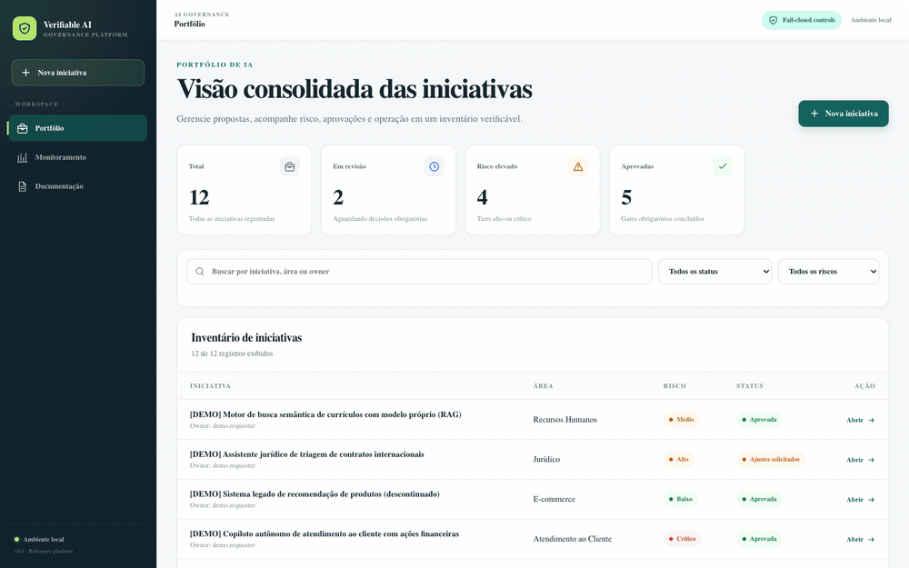
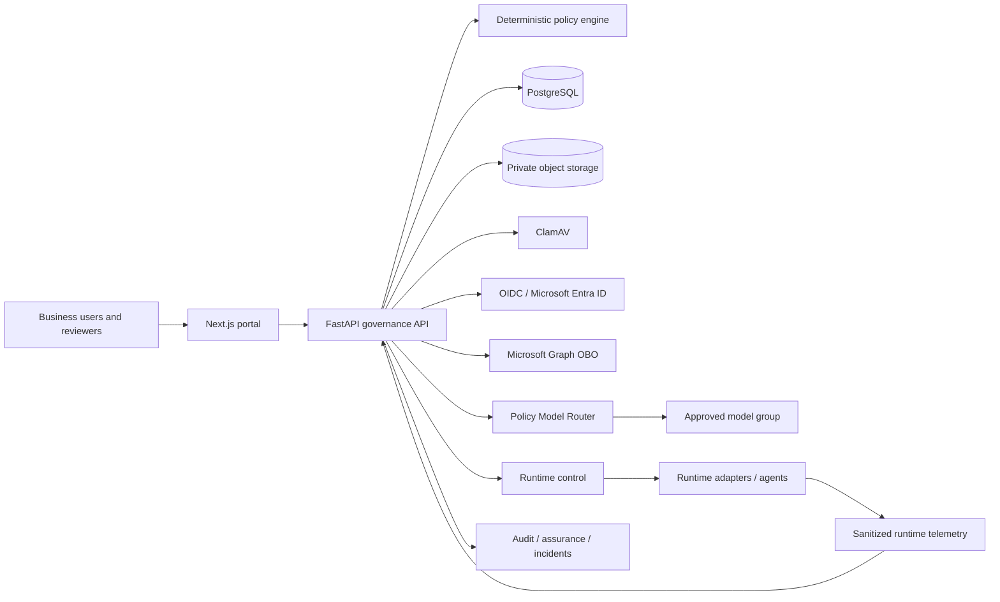

# Verifiable AI Governance

[Português](README.pt-BR.md)

[](https://github.com/brunovicco/verifiable-ai-governance/releases)
[](https://github.com/brunovicco/verifiable-ai-governance/actions/workflows/ci.yml)
[](https://github.com/brunovicco/verifiable-ai-governance/actions/workflows/reference-demo.yml)


A vendor-neutral reference platform for turning AI governance requirements into
**deterministic controls, independent approvals, signed authorization, runtime enforcement,
governed response and verifiable evidence**.

The project is designed for organizations that need to answer not only what a policy requires,
but also what was authorized, what happened at runtime, which control was applied and which
evidence proves it.

> **Maturity:** functional, production-oriented reference implementation. Selected enterprise
> integrations still require validation in real organizational environments. The final v0.2.0
> release-candidate evidence is intentionally regenerated only after source freeze.



*Real capture from the executable demo using synthetic data. Runtime and release evidence are
verified by separate repository-owned E2E and release-evidence checks rather than inferred from
this UI capture.*

## What this project proves

The current release-candidate code connects governance decisions to runtime evidence through an
explicit chain:

```text
Policy
  → Approval
  → Signed Authorization
  → Runtime Enforcement
  → Violation / Runtime Assurance
  → Governed Response
  → Evidence
```

| Proof | Current implementation |
|---|---|
| Policy is deterministic | Versioned policy inputs produce explainable risk, controls and gates |
| Approval is independently governed | Immutable review rounds and segregation of duties preserve who approved what |
| Authorization is bound to scope | Model/agent reviews and signed authorization bind runtime use to approved identities and scope |
| Runtime cannot silently expand scope | Policy Model Router outcomes are revalidated and invalid/out-of-scope outcomes fail closed |
| Denials become evidence | Trusted runtime violations are persisted as first-class, integrity-bound evidence |
| Runtime health feeds assurance | Sanitized telemetry is correlated to governed assets and evaluated through bounded assurance rules |
| Response can affect execution | Governed runtime controls support containment/restore paths with audit evidence |
| Releases are independently inspectable | SBOM/security, provenance, benchmark/SLO and clean-install evidence are cryptographically bound into release roots |

The deterministic canonical demo proves the local governance story. Separate live/cross-repository
E2E checks prove external Router, telemetry and governed-actuation boundaries. Release evidence is
rebuilt from frozen commits instead of treating screenshots or mutable dashboards as assurance.

## Live demo

A public, read-only demonstration is available at:

**[https://vaigov-app.duckdns.org](https://vaigov-app.duckdns.org)** — currently deployed from the
published [v0.1.0](https://github.com/brunovicco/verifiable-ai-governance/releases/tag/v0.1.0)
baseline.

The environment contains synthetic data. Anyone can browse with a self-declared local identity;
write operations, evidence uploads and governance decisions are rejected at the reverse proxy
before they reach the API. The public deployment version is intentionally stated separately from
the newer release-candidate capabilities in this repository.

See [`ops/gcp-demo/`](ops/gcp-demo/) for the demo infrastructure.

## Five-minute proof path

For a reviewer, architect or hiring manager, start with the
[Five-minute walkthrough](docs/demo/FIVE_MINUTE_WALKTHROUGH.md). It follows the canonical governed
credit scenario from proposal and approval through runtime decision, blocked scope, incident and
evidence.

To execute the local scenario:

```bash
cp .env.example .env
docker compose up --build
make seed-demo
```

Open:

- Portal: `http://localhost:3000`
- API documentation: `http://localhost:8000/docs`

Validate an existing deterministic seed without changing it:

```bash
uv run python -m scripts.seed_canonical_demo --check
```

The dedicated **Reference Demo** GitHub Actions workflow rebuilds an empty PostgreSQL database,
applies the migration chain, seeds the canonical scenario, validates it and executes the identity,
migration-history and repository-hygiene regression tests.

## Why verifiable?

| Mechanism | Assurance property |
|---|---|
| Deterministic, versioned policy engine | The same normalized facts and policy version produce the same classification and gates |
| Declarative control catalog | Applicability is explainable and does not depend on hidden model reasoning |
| Immutable review rounds | Corrections create a new round instead of rewriting prior decisions |
| Canonical scope digests | Model and agent approvals remain bound to the exact reviewed scope |
| Signed runtime authorization | Runtime permission is derived from approved scope and independently verifiable data |
| Verified evidence pipeline | Files are bounded, signature-checked, hashed, malware-scanned and stored privately |
| Hash-chained audit events | Later alteration of the recorded event sequence becomes detectable |
| Runtime routing enforcement | An external router cannot expand the model group authorized by governance |
| Trusted violation envelopes | Fail-closed denials preserve minimized violation identity and integrity information |
| Sanitized runtime telemetry | Operational assurance can be evaluated without storing prompts or model payloads by default |
| Governed actuation | Containment and restoration actions are controlled and auditable |
| Release evidence roots | Build/security/runtime/clean-install evidence can be re-derived and verified offline |

## Architecture



The API is authoritative for state transitions, authorization, segregation of duties, versioning
and audit. Frontend validation is never treated as a security boundary. Application use cases
depend on internal ports; FastAPI, SQLAlchemy, identity providers, object storage, Router and
runtime-control infrastructure remain adapters at the edge.

See [Architecture](docs/architecture/ARCHITECTURE.md),
[Trust boundaries](docs/architecture/TRUST_BOUNDARIES.md) and
[Security model](docs/security/SECURITY_MODEL.md).

## Core capabilities

| Capability | Current state |
|---|---|
| AI inventory | Initiatives, systems, models and agents with ownership, lifecycle, version, region and scope |
| Risk and impact | Deterministic preliminary risk plus structured AI impact, privacy and international-processing assessments |
| Assurance workflow | Conditional multidisciplinary gates, segregation of duties and immutable resubmissions |
| Control management | Versioned YAML baseline with 25 declarative controls and explainable applicability |
| Evidence | SHA-256, file-signature validation, mandatory malware scan, private storage and provenance |
| Corporate identity | OIDC, Microsoft Entra adapter, PKCE, Graph OBO and explicit authorization mappings |
| Asset assurance | Independent Architecture model review and Security agent review |
| Runtime authorization | Scope-bound authorization and revalidation before external model use |
| Runtime routing | Policy-based model-group routing with trusted fail-closed violation evidence |
| Runtime assurance | Sanitized telemetry ingestion, correlation and bounded assurance evaluation |
| Governed response | Incidents, kill switch/runtime control, temporary exceptions, remediation and restoration paths |
| Auditability | Optimistic concurrency, immutable snapshots and hash-chained audit records |
| Release assurance | SBOM/security evidence, provenance, runtime benchmark/SLO and frozen-source clean-install verification |
| Resilience | Explicit migrations, fresh-install regression coverage and verified backup/restore workflow |

## Demo vs. production boundary

The repository deliberately separates reference proof from deployment claims.

**Reference/demo defaults include:** synthetic business data, local explicit identity, local Docker
services, deterministic canonical seed data and example policy values.

**Production deployments still require organizational decisions and validation for:** identity
tenant/Conditional Access behavior, secret/key management, object-storage controls, network
boundaries, retention/legal hold, enterprise alerting, external-system ownership, policy values,
SLO thresholds and regulatory applicability.

The canonical seed uses a deterministic local Router adapter to create reproducible routing
records. It is not presented as a live Policy Model Router integration test. The separate governed
actuation E2E covers the live cross-repository boundary.

## Engineering and security evidence

- Python 3.12+, FastAPI, Pydantic and asynchronous SQLAlchemy;
- Next.js portal for non-technical requesters and reviewers;
- strict `mypy`, Ruff, Python tests, web tests, lint and production build;
- repository-hygiene gate that rejects checked-in local coding-agent/tool state;
- explicit Alembic migrations and empty-database migration regression;
- optimistic concurrency for mutable aggregates;
- transaction-scoped state transitions and audit events;
- pure deterministic policy/domain rules without infrastructure I/O;
- OIDC validation with asymmetric algorithms, issuer, audience and required claims;
- explicit Entra authorization mappings instead of department/group-name trust;
- private evidence storage, malware scanning and compensating rollback;
- runtime scope revalidation and trusted violation persistence;
- sanitized runtime telemetry and governed actuation verification;
- content-addressed release evidence with offline verification paths.

## Current maturity

| Area | State |
|---|---|
| Core governance workflow | Implemented |
| Structured assessments and verified evidence | Implemented |
| Model and agent assurance | Implemented |
| Signed runtime authorization and routing enforcement | Implemented |
| Trusted runtime violation evidence | Implemented |
| Sanitized runtime telemetry ingestion | Implemented |
| Runtime assurance and governed actuation | Implemented reference path; enterprise thresholds/operations remain deployment-specific |
| Runtime benchmark and SLO evidence | Implemented release-evidence path |
| Incidents, kill switch and exceptions | Implemented |
| Executive portfolio metrics | Implemented, with unavailable indicators shown explicitly |
| Generic OIDC validation | Implemented and locally verifiable |
| Microsoft Entra and Graph | Implemented; real-tenant and Conditional Access validation pending |
| Long-horizon statistical drift analytics | Partial; bounded runtime assurance exists, broader historical analytics remain roadmap work |
| CMDB, data catalog, CI/CD and enterprise GRC integrations | Planned |
| Portable scoped audit-package export | Planned |

See the [Capability matrix](docs/product/CAPABILITY_MATRIX.md) and
[Roadmap](docs/product/ROADMAP.md) for explicit boundaries.

## Release evidence

The repository contains versioned tooling for a coordinated release-candidate evidence chain:

```text
frozen source
  → release manifest
  → SBOM / vulnerability evidence
  → build provenance
  → runtime benchmark / SLO evidence
  → frozen-source clean-install evidence
  → release-candidate evidence index
  → GitHub OIDC / Sigstore attestation
```

The final `0.2.0-rc2` evidence is generated only after public-repository hardening and source freeze.
This prevents a polished README or workflow change from occurring after the commit that the release
evidence claims to represent.

## Documentation

Start with the [Documentation index](docs/README.md).

Recommended paths:

- Executives and hiring managers: [Executive overview](docs/executive/EXECUTIVE_OVERVIEW.md)
- Fast review: [Five-minute walkthrough](docs/demo/FIVE_MINUTE_WALKTHROUGH.md)
- Product and governance: [Capability matrix](docs/product/CAPABILITY_MATRIX.md)
- Architects: [Architecture](docs/architecture/ARCHITECTURE.md)
- Security: [Threat model](docs/security/THREAT_MODEL.md)
- Assurance: [Evidence model](docs/governance/EVIDENCE_MODEL.md)
- Operators: [Production readiness](docs/operations/PRODUCTION_READINESS.md)
- Developers: [Development guide](docs/DEVELOPMENT.md)

## Development

```bash
make setup
make quality
```

Public engineering guidance is tool-agnostic. Local coding-agent/editor configuration is ignored
and rejected if it becomes tracked. See [Development guide](docs/DEVELOPMENT.md) and
[CONTRIBUTING.md](CONTRIBUTING.md).

## Scope and disclaimer

This project provides a reference implementation for operational AI governance. Its controls,
templates, workflows and mappings do not constitute legal advice, certification, regulatory
approval or an automatic declaration of compliance. Organizations remain responsible for
validating policies, evidence, risk decisions and regulatory obligations in their own context.

## Security and license

Report security issues through [SECURITY.md](SECURITY.md), not a public issue.

Licensed under the Apache License, Version 2.0. See [LICENSE](LICENSE).
