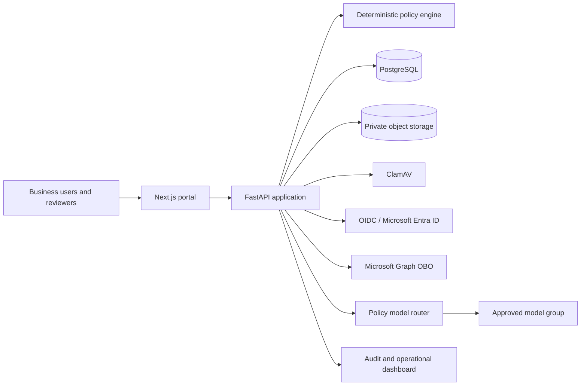

# Verifiable AI Governance

[Português](README.pt-BR.md)

[](https://github.com/brunovicco/verifiable-ai-governance/actions/workflows/ci.yml)


A vendor-neutral reference platform that turns AI governance requirements into
**deterministic controls, independent approvals, verified evidence, runtime enforcement
and tamper-evident audit trails**.

The project is designed for organizations that need to govern AI initiatives, systems,
models and agents without reducing governance to disconnected spreadsheets, policy
files and manual checklists.

> **Maturity:** functional, production-oriented reference implementation. Selected
> enterprise integrations still require validation in a real organizational environment.

## The problem

AI initiatives often begin across documents, tickets, spreadsheets and conversations.
As they move toward production, organizations struggle to answer basic assurance
questions:

- Who is accountable for the system?
- Which data, models, providers, regions and tools are involved?
- Which independent reviewers approved the current scope?
- Which evidence supported each decision?
- Does the runtime remain inside the approved conditions?
- What changed after approval, and can the history be verified?

Verifiable AI Governance creates an explicit chain from business context to runtime:

```text
Context → Risk → Controls → Assessments → Approvals → Evidence
        → AI assets → Runtime decisions → Monitoring → Incidents → Review
```

## Why verifiable?

| Mechanism | Assurance property |
|---|---|
| Deterministic, versioned policy engine | The same normalized facts and policy version produce the same classification and gates |
| Declarative control catalog | Applicability is explainable and can be evaluated without hidden model reasoning |
| Immutable review rounds | Corrections create a new round instead of rewriting prior decisions |
| Canonical scope digests | Model and agent approvals remain bound to the exact reviewed scope |
| Verified evidence pipeline | Uploaded files are limited, signature-checked, hashed, malware-scanned and stored privately |
| Hash-chained audit events | Later alteration of the recorded event sequence becomes detectable |
| Runtime routing enforcement | An external router cannot select a model group that governance did not approve |
| Fail-closed behavior | Missing or invalid critical dependencies do not become implicit authorization |

## Key capabilities

| Capability | Current implementation |
|---|---|
| AI inventory | Initiatives, systems, models and agents with ownership, lifecycle, version, region and scope |
| Risk and impact | Deterministic preliminary risk, structured AI impact, privacy and international-processing assessments |
| Assurance workflow | Conditional multidisciplinary gates, segregation of duties and immutable resubmissions |
| Control management | Versioned YAML baseline with 25 declarative controls and explainable applicability |
| Evidence | SHA-256, file signature validation, mandatory ClamAV scan, private S3-compatible storage and provenance |
| Corporate identity | OIDC, Microsoft Entra ID adapter, PKCE, Graph OBO and explicit role/group-object mappings |
| Asset assurance | Independent Architecture review for models and Security review for agents |
| Runtime governance | Approved-scope validation and policy-based model-group routing before external model use |
| Operational response | Incidents, kill switch, temporary exceptions, remediation and portfolio dashboard |
| Auditability | Optimistic concurrency, immutable snapshots and hash-chained audit records |
| Resilience | Explicit migrations, fail-closed startup and verified backup/restore workflow |

## Architecture



The API is authoritative for state transitions, authorization, segregation of duties,
versioning and audit. Frontend validation is never treated as a security boundary.
Application use cases depend on internal ports; FastAPI, SQLAlchemy, identity providers,
object storage and external routers remain adapters at the edge.

See [Architecture](docs/architecture/ARCHITECTURE.md),
[Trust boundaries](docs/architecture/TRUST_BOUNDARIES.md) and
[Security model](docs/security/SECURITY_MODEL.md).

## Five-minute local demo

Prerequisite: Docker Desktop.

```bash
cp .env.example .env
docker compose up --build
```

Open:

- Portal: `http://localhost:3000`
- API documentation: `http://localhost:8000/docs`

Populate representative governance scenarios:

```bash
make seed-demo
```

The seed covers multiple lifecycle states, risk tiers, assessment types and evidence
patterns using the application's real use cases. Follow the complete
[demo guide](docs/demo/DEMO_GUIDE.md).

> ClamAV may need additional time to prepare signatures on the first start. Evidence
> uploads fail closed until the scanner is ready.

## Engineering and security evidence

- Python 3.12+, FastAPI, Pydantic and asynchronous SQLAlchemy;
- Next.js portal for non-technical requesters and reviewers;
- strict `mypy`, Ruff, Python tests, web tests, lint and production build in CI;
- explicit Alembic migrations before API startup;
- optimistic concurrency for mutable aggregates;
- transaction-scoped state transitions and audit events;
- pure deterministic policy and domain rules without infrastructure I/O;
- OIDC validation with asymmetric algorithms, issuer, audience and required claims;
- explicit Microsoft Entra authorization mappings instead of department or group-name trust;
- minimal identity cache that excludes tokens, profiles and group object IDs;
- private evidence storage, malware scanning and compensating rollback;
- backup package verification and isolated restore testing;
- runtime scope revalidation before accepting a routing outcome.

## Current maturity

| Area | State |
|---|---|
| Core governance workflow | Implemented |
| Structured assessments and evidence | Implemented |
| Model and agent assurance | Implemented |
| Runtime model-routing enforcement | Implemented |
| Incidents, kill switch and exceptions | Implemented |
| Executive portfolio metrics | Implemented, with unavailable indicators shown explicitly |
| Generic OIDC validation | Implemented and locally verifiable |
| Microsoft Entra and Graph integration | Implemented; real-tenant and Conditional Access validation pending |
| Runtime telemetry ingestion | Planned |
| Real drift and control-effectiveness calculation | Planned |
| CMDB, data catalog, CI/CD and GRC integrations | Planned |

See the [capability matrix](docs/product/CAPABILITY_MATRIX.md) and
[roadmap](docs/product/ROADMAP.md) for the explicit boundaries.

## Documentation

Start with the [documentation index](docs/README.md).

Recommended paths:

- Executives and hiring managers: [Executive overview](docs/executive/EXECUTIVE_OVERVIEW.md)
- Product and governance teams: [Capability matrix](docs/product/CAPABILITY_MATRIX.md)
- Architects: [Architecture](docs/architecture/ARCHITECTURE.md)
- Security teams: [Threat model](docs/security/THREAT_MODEL.md)
- Assurance teams: [Evidence model](docs/governance/EVIDENCE_MODEL.md)
- Operators: [Production readiness](docs/operations/PRODUCTION_READINESS.md)
- Developers: [API guide](docs/integrations/API_GUIDE.md)

## Development

Without Docker for the applications:

```bash
make setup
docker compose up -d postgres
make migrate
make dev-api
```

In another terminal:

```bash
make dev-web
```

Run the quality gate:

```bash
make quality
```

## Repository structure

```text
apps/web                     Next.js portal
apps/api                     FastAPI application and persistence adapters
packages/governance-schemas Shared contracts and taxonomies
packages/policy-engine       Risk classification, controls and applicability
docs                         Product, governance, architecture and operations
```

## Scope and disclaimer

This project provides a reference implementation for operational AI governance. Its
controls, templates, workflows and mappings do not constitute legal advice,
certification, regulatory approval or an automatic declaration of compliance.
Organizations remain responsible for validating policies, evidence, risk decisions and
regulatory obligations in their own context.

## Contributing and security

Read [CONTRIBUTING.md](CONTRIBUTING.md) before proposing changes. Report security issues
through the process described in [SECURITY.md](SECURITY.md); do not disclose suspected
vulnerabilities in a public issue.

## License

Licensed under the Apache License, Version 2.0.
See [LICENSE](LICENSE) for details.
