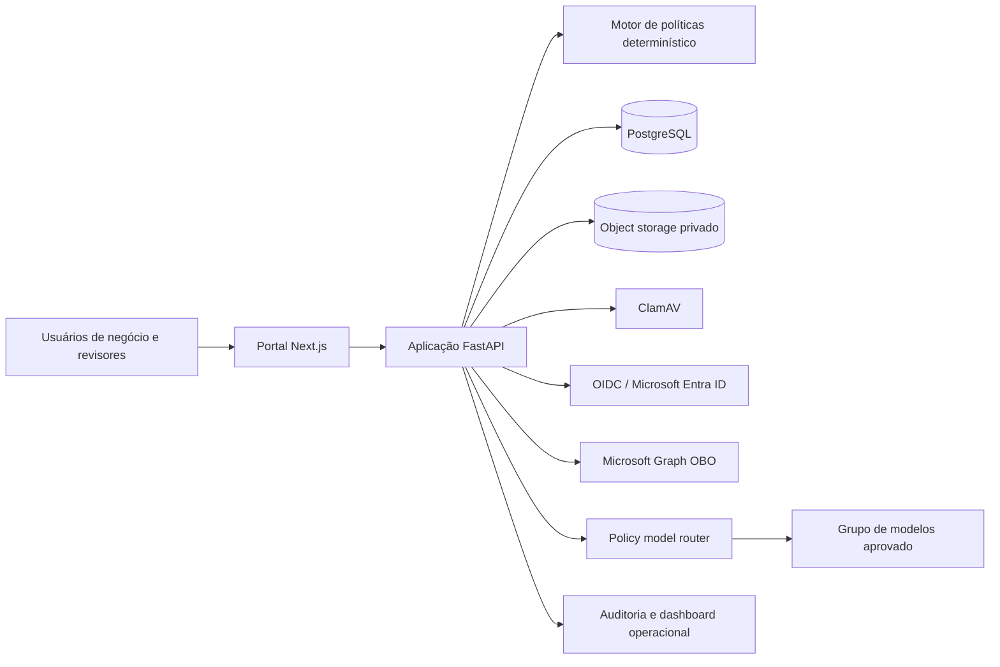

# Verifiable AI Governance

[English](README.md)

[](https://github.com/brunovicco/verifiable-ai-governance/actions/workflows/ci.yml)


Plataforma de referência, independente de fornecedor, que transforma requisitos de
governança de IA em **controles determinísticos, aprovações independentes, evidências
verificadas, enforcement em runtime e trilhas de auditoria com adulteração detectável**.

O projeto foi desenhado para organizações que precisam governar iniciativas, sistemas,
modelos e agentes de IA sem reduzir governança a planilhas, políticas e checklists
manuais desconectados da operação.

> **Maturidade:** implementação funcional e orientada à produção. Algumas integrações
> corporativas ainda precisam ser validadas em ambiente organizacional real.

## O problema

Iniciativas de IA frequentemente começam em documentos, tickets, planilhas e conversas.
Quando avançam para produção, surgem perguntas difíceis de responder:

- Quem responde pelo sistema?
- Quais dados, modelos, fornecedores, regiões e ferramentas estão envolvidos?
- Quais revisores independentes aprovaram o escopo atual?
- Quais evidências sustentaram cada decisão?
- O runtime continua dentro das condições aprovadas?
- O que mudou depois da aprovação e o histórico pode ser verificado?

A plataforma cria uma cadeia explícita entre contexto de negócio e operação:

```text
Contexto → Risco → Controles → Assessments → Aprovações → Evidências
         → Ativos de IA → Decisões em runtime → Monitoramento → Incidentes → Revisão
```

## Por que “verifiable”?

| Mecanismo | Propriedade de assurance |
|---|---|
| Motor de políticas determinístico e versionado | Os mesmos fatos normalizados e versão de política produzem a mesma classificação e os mesmos gates |
| Catálogo declarativo de controles | A aplicabilidade é explicável e não depende de raciocínio oculto de modelo |
| Rodadas imutáveis de revisão | Correções criam uma nova rodada em vez de reescrever decisões anteriores |
| Digests canônicos de escopo | Aprovações de modelos e agentes permanecem vinculadas ao escopo revisado |
| Pipeline de evidência verificada | Arquivos são limitados, validados, hasheados, escaneados e armazenados de forma privada |
| Auditoria encadeada por hash | Alterações posteriores na sequência de eventos podem ser detectadas |
| Enforcement de roteamento | Um roteador externo não pode escolher um grupo de modelos não aprovado |
| Comportamento fail-closed | Dependências críticas ausentes ou inválidas não geram autorização implícita |

## Capacidades principais

| Capacidade | Implementação atual |
|---|---|
| Inventário de IA | Iniciativas, sistemas, modelos e agentes com owner, ciclo de vida, versão, região e escopo |
| Risco e impacto | Triagem determinística e assessments estruturados de impacto, privacidade e processamento internacional |
| Workflow de assurance | Gates multidisciplinares, segregação de funções e ressubmissões imutáveis |
| Gestão de controles | Baseline YAML versionada com 25 controles e aplicabilidade explicável |
| Evidências | SHA-256, validação de assinatura, ClamAV obrigatório, storage privado e provenance |
| Identidade corporativa | OIDC, adapter Microsoft Entra ID, PKCE, Graph OBO e mappings explícitos |
| Assurance de ativos | Revisão de modelos por Arquitetura e de agentes por Segurança |
| Governança em runtime | Validação de escopo aprovado e roteamento por grupo de modelos antes do uso externo |
| Resposta operacional | Incidentes, kill switch, exceções temporárias, remediação e dashboard |
| Auditabilidade | Concorrência otimista, snapshots imutáveis e eventos encadeados por hash |
| Resiliência | Migrações explícitas, startup fail-closed e backup/restore verificável |

## Arquitetura



A API é a autoridade sobre transições de estado, autorização, segregação de funções,
versionamento e auditoria. Validações do frontend não são tratadas como fronteira de
segurança. Casos de uso dependem de portas internas; FastAPI, SQLAlchemy, provedores de
identidade, storage e roteadores externos ficam nos adapters.

Consulte [Arquitetura](docs/architecture/ARCHITECTURE.md),
[Trust boundaries](docs/architecture/TRUST_BOUNDARIES.md) e
[Modelo de segurança](docs/security/SECURITY_MODEL.md).

## Demonstração local

Pré-requisito: Docker Desktop.

```bash
cp .env.example .env
docker compose up --build
```

Abra:

- Portal: `http://localhost:3000`
- Documentação da API: `http://localhost:8000/docs`

Popule cenários representativos:

```bash
make seed-demo
```

O seed cobre diferentes estados, tiers de risco, assessments e padrões de evidência
usando os casos de uso reais da aplicação. Siga o
[guia completo de demonstração](docs/demo/DEMO_GUIDE.md).

> Na primeira inicialização, o ClamAV pode levar algum tempo para preparar as
> assinaturas. Uploads falham de forma fechada até o scanner ficar disponível.

## Evidências de engenharia e segurança

- Python 3.12+, FastAPI, Pydantic e SQLAlchemy assíncrono;
- portal Next.js para solicitantes e aprovadores não técnicos;
- `mypy` estrito, Ruff, testes Python, testes web, lint e build no CI;
- migrações Alembic explícitas antes do startup da API;
- concorrência otimista em agregados mutáveis;
- transições e auditoria na mesma fronteira transacional;
- políticas e regras de domínio puras e determinísticas;
- OIDC com algoritmos assimétricos, issuer, audience e claims obrigatórios;
- mappings explícitos de autorização do Entra em vez de confiar em departamento ou nome de grupo;
- cache mínimo de identidade, sem token, perfil ou object IDs de grupos;
- storage privado de evidências, malware scan e rollback compensatório;
- backup verificado e teste de restore em destinos isolados;
- revalidação de escopo antes de aceitar uma decisão de roteamento.

## Maturidade atual

| Área | Estado |
|---|---|
| Workflow central de governança | Implementado |
| Assessments e evidências | Implementado |
| Assurance de modelos e agentes | Implementado |
| Enforcement de roteamento | Implementado |
| Incidentes, kill switch e exceções | Implementado |
| Métricas executivas | Implementadas, exibindo indisponibilidade quando aplicável |
| OIDC genérico | Implementado e verificável localmente |
| Microsoft Entra e Graph | Implementado; validação em tenant real e Conditional Access pendente |
| Ingestão de telemetria de runtime | Planejada |
| Drift real e efetividade de controles | Planejados |
| Integrações com CMDB, catálogo de dados, CI/CD e GRC | Planejadas |

Consulte a [matriz de capacidades](docs/product/CAPABILITY_MATRIX.md) e o
[roadmap](docs/product/ROADMAP.md).

## Documentação

Comece pelo [índice da documentação](docs/README.md).

Caminhos recomendados:

- Executivos e recrutadores: [Visão executiva](docs/executive/EXECUTIVE_OVERVIEW.md)
- Produto e Governança: [Matriz de capacidades](docs/product/CAPABILITY_MATRIX.md)
- Arquitetura: [Arquitetura](docs/architecture/ARCHITECTURE.md)
- Segurança: [Threat model](docs/security/THREAT_MODEL.md)
- Assurance: [Modelo de evidências](docs/governance/EVIDENCE_MODEL.md)
- Operação: [Production readiness](docs/operations/PRODUCTION_READINESS.md)
- Desenvolvimento: [Guia da API](docs/integrations/API_GUIDE.md)

## Desenvolvimento

Sem Docker para as aplicações:

```bash
make setup
docker compose up -d postgres
make migrate
make dev-api
```

Em outro terminal:

```bash
make dev-web
```

Execute o gate de qualidade:

```bash
make quality
```

## Estrutura

```text
apps/web                     Portal Next.js
apps/api                     Aplicação FastAPI e adapters de persistência
packages/governance-schemas Contratos e taxonomias compartilhadas
packages/policy-engine       Classificação, controles e aplicabilidade
docs                         Produto, governança, arquitetura e operação
```

## Escopo e aviso

Este projeto é uma implementação de referência para governança operacional de IA. Seus
controles, templates, workflows e mapeamentos não constituem parecer jurídico,
certificação, aprovação regulatória ou declaração automática de conformidade. Cada
organização precisa validar políticas, evidências, decisões de risco e obrigações no seu
próprio contexto.

## Contribuição e segurança

Leia [CONTRIBUTING.md](CONTRIBUTING.md) antes de propor alterações. Vulnerabilidades
devem seguir [SECURITY.md](SECURITY.md) e não devem ser publicadas em uma issue aberta.

## Licença

Licenciado sob a Licença Apache, Versão 2.0.
Veja [LICENSE](LICENSE) para detalhes.

