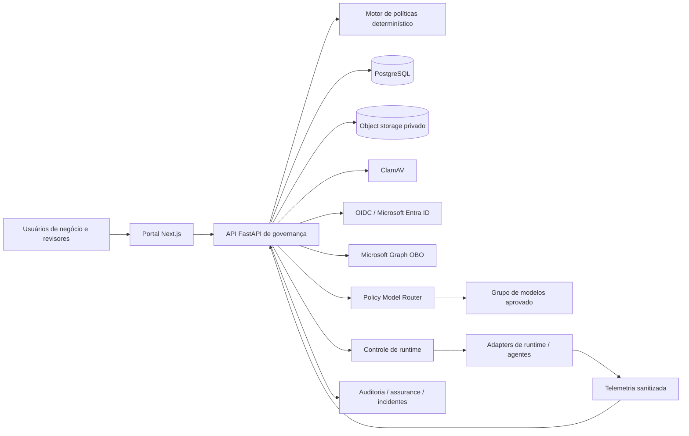

# Verifiable AI Governance

[English](README.md)

[](https://github.com/brunovicco/verifiable-ai-governance/releases)
[](https://github.com/brunovicco/verifiable-ai-governance/actions/workflows/ci.yml)
[](https://github.com/brunovicco/verifiable-ai-governance/actions/workflows/reference-demo.yml)


Plataforma de referência, independente de fornecedor, para transformar requisitos de governança
de IA em **controles determinísticos, aprovações independentes, autorização assinada, enforcement
em runtime, resposta governada e evidência verificável**.

O projeto foi desenhado para organizações que precisam responder não apenas o que uma política
exige, mas também o que foi autorizado, o que ocorreu em runtime, qual controle foi aplicado e
qual evidência comprova isso.

> **Maturidade:** implementação de referência funcional e orientada à produção. Algumas
> integrações corporativas ainda exigem validação em ambientes organizacionais reais. A evidência
> final do release candidate v0.2.0 é regenerada intencionalmente somente após o congelamento do
> código-fonte.


*Captura real da demo executável com dados sintéticos. Evidências de runtime e de release são
verificadas por E2Es e gates próprios do repositório, sem serem inferidas desta captura de UI.*

## O que este projeto comprova

O código atual do release candidate conecta decisões de governança à operação por meio de uma
cadeia explícita:

```text
Política
  → Aprovação
  → Autorização Assinada
  → Enforcement em Runtime
  → Violação / Runtime Assurance
  → Resposta Governada
  → Evidência
```

| Prova | Implementação atual |
| --- | --- |
| A política é determinística | Entradas e versões de política produzem risco, controles e gates explicáveis |
| A aprovação é governada de forma independente | Rodadas imutáveis e segregação de funções preservam quem aprovou o quê |
| A autorização está vinculada ao escopo | Revisões de modelo/agente e autorização assinada vinculam o runtime às identidades e ao escopo aprovados |
| O runtime não amplia o escopo silenciosamente | Resultados do Policy Model Router são revalidados; respostas inválidas ou fora do escopo falham de forma fechada |
| Bloqueios viram evidência | Violações confiáveis de runtime são persistidas como evidência de primeira classe com integridade vinculada |
| Saúde operacional alimenta assurance | Telemetria sanitizada é correlacionada aos ativos governados e avaliada por regras limitadas e explícitas |
| A resposta pode afetar a execução | Controles de runtime governados oferecem contenção/restauração com evidência auditável |
| Releases são inspecionáveis | SBOM/segurança, provenance, benchmark/SLO e fresh install são vinculados a roots verificáveis |

A demo canônica determinística prova a história local de governança. E2Es separados provam as
fronteiras reais entre repositórios para Router, telemetria e atuação governada. A evidência de
release é reconstruída a partir de commits congelados, em vez de tratar screenshots ou dashboards
mutáveis como assurance.

## Demo pública

Uma demonstração pública e somente leitura está disponível em:

**[https://vaigov-app.duckdns.org](https://vaigov-app.duckdns.org)** — atualmente implantada a
partir da baseline publicada
[v0.1.0](https://github.com/brunovicco/verifiable-ai-governance/releases/tag/v0.1.0).

O ambiente contém dados sintéticos. Qualquer pessoa pode navegar com uma identidade local
autodeclarada; operações de escrita, upload de evidências e decisões de governança são rejeitadas
na borda antes de chegar à API. A versão da demo pública é informada separadamente das capacidades
mais novas do release candidate presentes no repositório.

Veja [`ops/gcp-demo/`](ops/gcp-demo/) para a infraestrutura da demo.

## Caminho de prova em cinco minutos

Para uma avaliação rápida por recrutadores, arquitetos ou lideranças técnicas, comece pelo
[passo a passo em cinco minutos](docs/demo/FIVE_MINUTE_WALKTHROUGH.pt-BR.md). Ele percorre o
cenário canônico de crédito governado desde a proposta e aprovação até decisão de runtime,
bloqueio de escopo, incidente e evidência.

Para executar localmente:

```bash
cp .env.example .env
docker compose up --build
make seed-demo
```

Abra:

- Portal: `http://localhost:3000`
- Documentação da API: `http://localhost:8000/docs`

Valide um seed determinístico já existente sem alterá-lo:

```bash
uv run python -m scripts.seed_canonical_demo --check
```

O workflow **Reference Demo** do GitHub Actions recria um PostgreSQL vazio, aplica toda a cadeia de
migrações, gera o cenário canônico, valida o cenário e executa regressões de identidade,
histórico de migrações e higiene do repositório.

## Por que “verifiable”?

| Mecanismo | Propriedade de assurance |
| --- | --- |
| Motor de política determinístico e versionado | Os mesmos fatos normalizados e versão produzem a mesma classificação e gates |
| Catálogo declarativo de controles | A aplicabilidade é explicável e não depende de raciocínio oculto de modelo |
| Rodadas imutáveis de revisão | Correções criam uma nova rodada em vez de reescrever decisões anteriores |
| Digests canônicos de escopo | Aprovações de modelos e agentes permanecem vinculadas ao escopo revisado |
| Autorização assinada de runtime | A permissão deriva do escopo aprovado e de dados verificáveis de forma independente |
| Pipeline de evidência verificada | Arquivos são limitados, validados, hasheados, escaneados e armazenados de forma privada |
| Auditoria encadeada por hash | Alterações posteriores na sequência de eventos tornam-se detectáveis |
| Enforcement de roteamento | Um roteador externo não pode ampliar o grupo de modelos autorizado pela governança |
| Envelopes confiáveis de violação | Bloqueios fail-closed preservam identidade mínima e integridade da violação |
| Telemetria sanitizada de runtime | Assurance operacional pode ser avaliada sem armazenar prompts ou payloads de modelo por padrão |
| Atuação governada | Ações de contenção e restauração são controladas e auditáveis |
| Roots de evidência de release | Evidências de build/segurança/runtime/fresh install podem ser rederivadas e verificadas offline |

## Arquitetura



A API é autoridade sobre transições de estado, autorização, segregação de funções, versionamento e
auditoria. Validações do frontend nunca são tratadas como fronteira de segurança. Casos de uso
dependem de portas internas; FastAPI, SQLAlchemy, identidade, storage, Router e infraestrutura de
controle de runtime permanecem em adapters nas bordas.

Veja [Arquitetura](docs/architecture/ARCHITECTURE.md),
[Trust boundaries](docs/architecture/TRUST_BOUNDARIES.md) e
[Modelo de segurança](docs/security/SECURITY_MODEL.md).

## Capacidades principais

| Capacidade | Estado atual |
| --- | --- |
| Inventário de IA | Iniciativas, sistemas, modelos e agentes com owner, ciclo de vida, versão, região e escopo |
| Risco e impacto | Risco preliminar determinístico e assessments estruturados de impacto, privacidade e processamento internacional |
| Workflow de assurance | Gates multidisciplinares condicionais, segregação de funções e ressubmissões imutáveis |
| Gestão de controles | Baseline YAML versionada com 25 controles e aplicabilidade explicável |
| Evidências | SHA-256, validação de assinatura, malware scan obrigatório, storage privado e provenance |
| Identidade corporativa | OIDC, adapter Microsoft Entra, PKCE, Graph OBO e mappings explícitos de autorização |
| Assurance de ativos | Revisão independente de modelo por Arquitetura e de agente por Segurança |
| Autorização em runtime | Autorização vinculada ao escopo e revalidação antes de uso externo de modelo |
| Roteamento em runtime | Roteamento por política com evidência confiável de violação fail-closed |
| Runtime assurance | Ingestão de telemetria sanitizada, correlação e avaliação limitada de assurance |
| Resposta governada | Incidentes, kill switch/controle de runtime, exceções temporárias, remediação e restauração |
| Auditabilidade | Concorrência otimista, snapshots imutáveis e registros de auditoria encadeados por hash |
| Assurance de release | SBOM/segurança, provenance, benchmark/SLO e fresh-install a partir de fonte congelada |
| Resiliência | Migrações explícitas, regressão de fresh install e backup/restore verificado |

## Fronteira entre demo e produção

O repositório separa explicitamente prova de referência de alegações de implantação.

**Defaults de referência/demo incluem:** dados de negócio sintéticos, identidade local explícita,
serviços Docker locais, seed canônico determinístico e valores de política de exemplo.

**Implantações produtivas ainda exigem decisões e validações organizacionais para:** tenant de
identidade/Conditional Access, gestão de segredos e chaves, controles de storage, fronteiras de
rede, retenção/legal hold, alertas corporativos, ownership de sistemas externos, valores de
política, thresholds de SLO e aplicabilidade regulatória.

O seed canônico usa um adapter determinístico local de Router para gerar registros reproduzíveis.
Ele não é apresentado como teste de integração live com o Policy Model Router. O E2E separado de
atuação governada cobre a fronteira real entre repositórios.

## Evidências de engenharia e segurança

- Python 3.12+, FastAPI, Pydantic e SQLAlchemy assíncrono;
- portal Next.js para solicitantes e revisores não técnicos;
- `mypy` estrito, Ruff, testes Python, testes web, lint e build de produção;
- gate de higiene que rejeita estado local de ferramentas/agentes versionado por engano;
- migrações Alembic explícitas e regressão a partir de banco vazio;
- concorrência otimista em agregados mutáveis;
- transições e auditoria na mesma fronteira transacional;
- políticas e regras de domínio puras e determinísticas;
- OIDC com algoritmos assimétricos, issuer, audience e claims obrigatórios;
- mappings explícitos de autorização Entra em vez de confiar em departamento/nome de grupo;
- storage privado de evidências, malware scan e rollback compensatório;
- revalidação de escopo e persistência confiável de violações em runtime;
- telemetria sanitizada e verificação de atuação governada;
- evidência de release content-addressed com caminhos de verificação offline.

## Maturidade atual

| Área | Estado |
| --- | --- |
| Workflow central de governança | Implementado |
| Assessments estruturados e evidência verificada | Implementado |
| Assurance de modelos e agentes | Implementado |
| Autorização assinada e enforcement em runtime | Implementado |
| Evidência confiável de violações em runtime | Implementado |
| Ingestão de telemetria sanitizada | Implementado |
| Runtime assurance e atuação governada | Caminho de referência implementado; thresholds/operação corporativa são específicos da implantação |
| Benchmark de runtime e evidência de SLO | Caminho de evidência de release implementado |
| Incidentes, kill switch e exceções | Implementado |
| Métricas executivas | Implementadas, com indisponibilidade explícita quando aplicável |
| OIDC genérico | Implementado e verificável localmente |
| Microsoft Entra e Graph | Implementados; validação em tenant real e Conditional Access pendente |
| Analytics estatístico de drift de longo horizonte | Parcial; há assurance limitada em runtime, analytics histórico amplo continua no roadmap |
| Integrações CMDB, catálogo de dados, CI/CD e GRC corporativo | Planejadas |
| Exportação portátil e escopada de pacote de auditoria | Planejada |

Veja a [Matriz de capacidades](docs/product/CAPABILITY_MATRIX.md) e o
[Roadmap](docs/product/ROADMAP.md).

## Evidência de release

O repositório contém tooling versionado para uma cadeia coordenada de release candidate:

```text
fonte congelada
  → manifest de release
  → SBOM / vulnerabilidades
  → build provenance
  → benchmark de runtime / SLO
  → fresh install a partir da fonte congelada
  → índice final de evidências
  → attestation GitHub OIDC / Sigstore
```

A evidência final `0.2.0-rc2` será gerada somente após o hardening público e o source freeze. Isso
impede que mudanças de README, documentação ou workflow ocorram depois do commit que a evidência
afirma representar.

## Documentação

Comece pelo [Índice da documentação](docs/README.md).

Caminhos recomendados:

- Executivos e recrutadores: [Visão executiva](docs/executive/EXECUTIVE_OVERVIEW.md)
- Avaliação rápida: [Passo a passo em cinco minutos](docs/demo/FIVE_MINUTE_WALKTHROUGH.pt-BR.md)
- Produto e governança: [Matriz de capacidades](docs/product/CAPABILITY_MATRIX.md)
- Arquitetura: [Arquitetura](docs/architecture/ARCHITECTURE.md)
- Segurança: [Threat model](docs/security/THREAT_MODEL.md)
- Assurance: [Modelo de evidências](docs/governance/EVIDENCE_MODEL.md)
- Operação: [Production readiness](docs/operations/PRODUCTION_READINESS.md)
- Desenvolvimento: [Guia de desenvolvimento](docs/DEVELOPMENT.md)

## Desenvolvimento

```bash
make setup
make quality
```

A orientação pública de engenharia é independente de ferramenta. Configuração local de agentes ou
editores é ignorada e rejeitada caso se torne tracked. Veja
[Guia de desenvolvimento](docs/DEVELOPMENT.md) e [CONTRIBUTING.md](CONTRIBUTING.md).

## Escopo e aviso

Este projeto fornece uma implementação de referência para governança operacional de IA. Seus
controles, templates, workflows e mapeamentos não constituem parecer jurídico, certificação,
aprovação regulatória ou declaração automática de conformidade. Cada organização continua
responsável por validar políticas, evidências, decisões de risco e obrigações no próprio contexto.

## Segurança e licença

Vulnerabilidades devem seguir [SECURITY.md](SECURITY.md), não uma issue pública.

Licenciado sob a Licença Apache, Versão 2.0. Veja [LICENSE](LICENSE).
