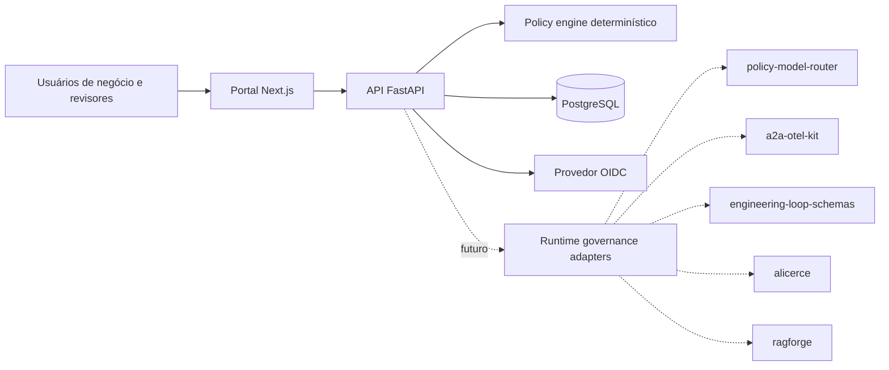
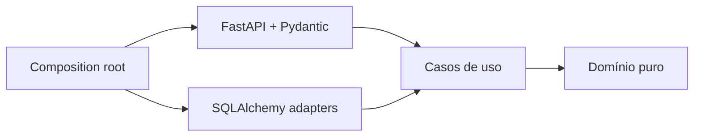
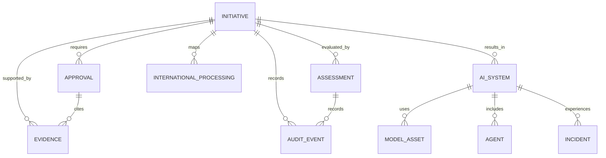

# Arquitetura

## Visão de contexto

## Componentes

### Portal

Next.js 16 com App Router. O navegador acessa a API diretamente no ambiente local. A
interface prioriza termos de negócio, apresenta risco, documentos e gates, e mantém os
detalhes técnicos sob demanda.

### API

FastAPI, SQLAlchemy assíncrono e Pydantic. A API é a autoridade sobre transições de
estado, segregação de funções, autorização, versionamento e auditoria. Regras críticas
não dependem de validações do frontend.

Os routers são adaptadores HTTP finos. Serviços de aplicação coordenam casos de uso,
transações e auditoria sem depender de exceções ou status do FastAPI. Dependências são
ligadas no composition root: em especial, a avaliação de política depende do contrato
`PolicyEvaluator`, permitindo substituir o motor determinístico por outra implementação
compatível sem alterar o caso de uso (Dependency Inversion).

Erros esperados usam categorias de aplicação estáveis e são traduzidos para HTTP apenas
na borda. Configuração de deploy é imutável, fornecida pelo ambiente e validada de forma
fail-closed antes de servir tráfego.

### Assessments estruturados

O módulo de assessments aplica Clean Architecture com dependências apontando para o
núcleo. Tipos imutáveis e regras de aplicabilidade vivem no domínio; casos de uso
definem as portas de persistência, auditoria e transação que consomem; adapters
SQLAlchemy implementam essas portas; Pydantic e FastAPI existem apenas na borda HTTP.

Cada definição tem contrato e versão explícitos. O banco garante apenas uma avaliação
corrente por tipo e iniciativa. Rascunhos pertencem ao owner (ou administrador), usam
versão esperada para mutações e, quando submetidos, tornam-se imutáveis até existir o
workflow explícito de revisão e ressubmissão. A auditoria registra tipo, versão, risco e
campos alterados, sem duplicar respostas potencialmente sensíveis.

O desenho também preserva propriedades dos Twelve-Factor Apps: configuração vem do
ambiente, processos de API permanecem stateless, PostgreSQL é um backing service
substituível por configuração, logs são eventos e dependências são declaradas e
reprodutíveis pelos lockfiles.

### Governance schemas

Pacote compartilhado que define enums, contexto de política, decisão, breakdown de
risco e requisitos de aprovação. É independente de FastAPI e da persistência.

### Policy engine

Função determinística e versionada. Recebe um contexto completo e retorna score, tier,
documentos, bloqueios e a situação de cada gate. Não faz I/O e pode ser testada ou
substituída por uma implementação compatível.

### Catálogo de controles

O catálogo baseline é um YAML versionado validado por contratos imutáveis do pacote
`governance-schemas`. O `policy-engine` carrega o recurso uma vez e avalia seletores
declarativos contra o mesmo contexto normalizado usado na classificação de risco. A
aplicação consome apenas a porta `ControlCatalogPort`; FastAPI e SQLAlchemy permanecem
nos adapters externos.

O relatório contém os 25 controles, resultado e razões para cada um, além da versão do
catálogo. Ele é derivado sob consulta, não persistido, evitando estado duplicado e
permitindo reavaliação determinística. Um caminho alternativo pode ser injetado por
`CONTROL_CATALOG_PATH`; falhas de leitura ou validação interrompem a inicialização.

### Persistência

PostgreSQL mantém o estado transacional. Entidades mutáveis possuem `version`; comandos
de decisão exigem `expected_version`. Eventos de auditoria são append-only e encadeados
por hash para tornar alterações posteriores detectáveis.

### Inventário operacional

Uma iniciativa em estado `approved` pode originar um ou mais sistemas. A criação é
restrita ao owner da iniciativa; mutações de sistema, modelo e agente são restritas ao
owner do sistema ou a um administrador. Todos os comandos mutáveis exigem a versão
esperada. Aposentadoria substitui exclusão física e fecha o agregado para novas
alterações, preservando os registros e eventos de auditoria.

## Modelo lógico inicial

## Limites de confiança

- o navegador não é confiável para autorização ou transição de estado;
- identidade local só existe quando `APP_ENV=local` e exige header explícito;
- fora de local, a configuração sem OIDC é recusada na inicialização;
- uma declaração de agente não equivale a evidência confiável;
- referências de evidência informadas por humanos começam como `trusted_source=false`;
- conteúdo de prompts e documentos não deve entrar na trilha operacional por padrão.

## Portas de integração futuras

| Integração | Entrada esperada | Evidência produzida |
|---|---|---|
| `policy-model-router` | contexto de risco e classe de dado | decisão, policy digest e rejeições |
| `a2a-otel-kit` | spans/eventos sanitizados | correlação de modelos, agentes, A2A e MCP |
| `engineering-loop-schemas` | contrato, execução e veredito | evidência independente vinculada ao artefato |
| `alicerce` | pedido de execução controlada | limites, isolamento e resultado verificável |
| `ragforge` | dataset e estratégia versionados | métricas, regressões e provenance de fontes |

Adaptações devem depender de contratos internos, ser idempotentes e não alterar uma
decisão aprovada sem abrir change assessment.
