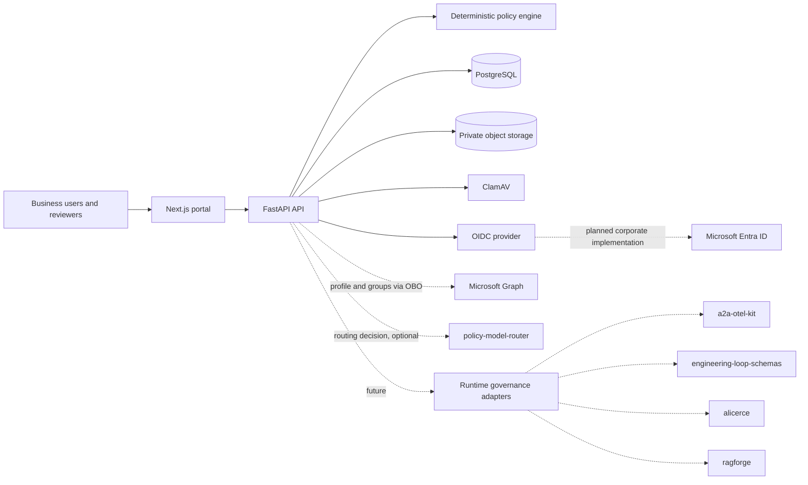
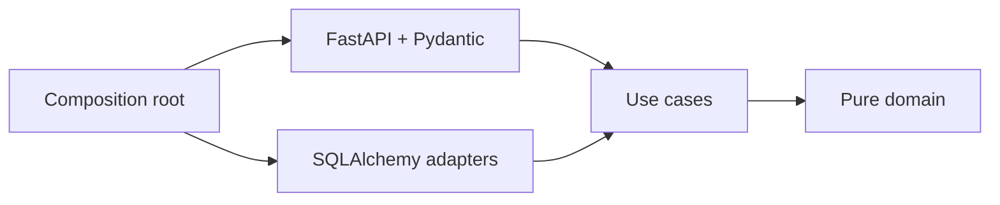
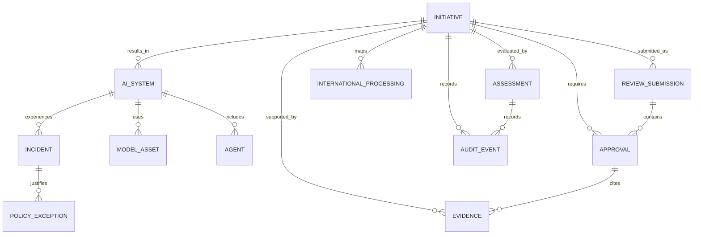

# Architecture

## Context view

## Components

### Portal

Next.js 16 with App Router. The browser accesses the API directly in the local
environment. The interface prioritizes business terms, surfaces risk, documents and
gates, and keeps technical detail available on demand.

### API

FastAPI, async SQLAlchemy and Pydantic. The API is the authority over state
transitions, separation of duties, authorization, versioning and auditing. Critical
rules never depend on frontend validation.

Routers are thin HTTP adapters. Application services orchestrate use cases,
transactions and auditing without depending on FastAPI exceptions or status codes.
Dependencies are wired at the composition root: in particular, policy evaluation
depends on the `PolicyEvaluator` contract, so the deterministic engine could be
replaced by another compatible implementation without touching the use case
(Dependency Inversion).

Expected errors use stable application-level categories and are translated to HTTP
only at the edge. Deploy configuration is immutable, supplied by the environment and
validated fail-closed before serving traffic.

### Identity and authentication

The domain holds only immutable identity and claim-mapping rules. The use case
depends on a `TokenVerifier` port; the PyJWT adapter implements cryptographic
validation via JWKS; FastAPI merely converts bearer credentials and typed errors to
HTTP. The synchronous, cached key lookup runs outside the event loop.

Issuer, audience, JWKS URL, algorithms, claims, timeouts and limits come from the
environment. Configuration accepts only known asymmetric algorithms, requires TLS
outside local and test, and never derives endpoints from the provider. Tokens must
contain `exp`, `iat` and `sub`. Only the JSON boolean `true` grants administration;
unknown roles never turn into approval areas.

The optional OIDC compose profile imports a declarative Keycloak realm to validate
real token issuance, audience, groups and rejection of missing or tampered
credentials. This test setup does not couple the runtime to Keycloak.

The portal already has a Microsoft Entra ID adapter using MSAL Browser/React,
Authorization Code + PKCE, a tenant-specific authority, `sessionStorage` caching and
an access token scoped to the API. In Entra mode the client drops the simulated
identity headers and sends only a bearer token; the API remains the authority over
authentication and authorization. Local mode stays explicitly separate.

In corporate mode, the domain requires `tid` and `oid` as UUIDs and produces the
stable composite identity `(tenant_id, object_id)`. The tenant must be on the
allowlist and match the tenant-specific Entra issuer. The optional `acct` claim
classifies member vs. guest; guest and missing/ambiguous classification lose
approval and administration capabilities by default.

Microsoft Graph via OBO implements the `CorporateDirectoryPort` to obtain profile,
`department` and transitive group object IDs with minimal collection. The adapter
uses fixed endpoints, timeouts, validated pagination and bounded retry for
idempotent reads. `Retry-After` is honored only within the interactive budget;
without that header, the adapter falls back to exponential backoff with jitter. The
OBO exchange is never retried automatically. The use case binds the result to
`(tenant_id, object_id)`. The endpoint exposes only the profile; group count and
listing stay internal. Entra tokens can carry at most 200 object IDs in the `groups`
claim. The domain distinguishes a missing, complete and overage claim;
`_claim_sources` never drives network calls. A trusted Graph snapshot takes
precedence over the token, while overage without Graph denies only group-based
capabilities and records the minimized source in the provenance. Authorizations
continue to derive only from App Roles or object IDs present in the tenant-specific
YAML catalog, never from names or `department`. The decision returns catalog,
version, digest and mapping IDs; approvals persist that provenance in the audit
chain. The packaged default is empty and changes can be supplied via external
configuration. The detailed plan is in `MICROSOFT_ENTRA_GRAPH_PLAN.md`.

Already-derived authorization snapshots use PostgreSQL as a cache shared across
replicas. The core requires a non-expired TTL, the current catalog digest and the
absence of an invalidation issued after the resolution. The cache holds only areas,
mapping IDs and provenance; token, profile and group object IDs are never stored. An
administrative invalidation clears the snapshot and writes hash-chained evidence in
the same transaction.

A separate emergency restriction is checked after authentication and before every
protected route. PostgreSQL holds the current state keyed by `(tenant_id,
object_id)`, and a read failure blocks the request. Blocking or restoring also
invalidates the authorization cache and writes minimized audit evidence in the same
transaction. This control cuts off platform access immediately but does not replace
disabling the account or revoking sessions in Entra. These decisions are captured in
ADRs 0011 through 0018.

### Structured assessments

The assessments module applies Clean Architecture with dependencies pointing inward.
Immutable types and applicability rules live in the domain; use cases define the
persistence, audit and transaction ports they consume; SQLAlchemy adapters implement
those ports; Pydantic and FastAPI exist only at the HTTP edge.

Each definition has an explicit contract and version. The database enforces only one
current assessment per type and initiative. Drafts belong to the owner (or an
administrator), use an expected version for mutations, and once submitted become
immutable until the explicit review-and-resubmission workflow reopens them. Auditing
records type, version, risk and changed fields, without duplicating potentially
sensitive answers.

### Review rounds

Critical review transitions and separation of duties live in a pure domain,
independent of FastAPI, Pydantic and SQLAlchemy. Each submission materializes an
immutable snapshot of the proposal and the assessments and creates gates exclusive
to that round. The `Initiative` projection points to the current round, while the
history remains queryable in minimized form by authorized participants.

Submission, review, resubmission and decision commands lock the initiative in the
transaction and validate expected versions. A change request closes the round,
replaces pending gates and reopens assessments. The owner saves the new facts
first; the policy then recalculates documents and gates to allow creating any
newly required assessments. A new round is only born once every applicable
structured assessment has been resubmitted. Full snapshots are never exposed by the
history API nor copied into the audit trail.

The design also preserves Twelve-Factor App properties: configuration comes from
the environment, API processes stay stateless, PostgreSQL is a swappable backing
service by configuration, logs are events, and dependencies are declared and
reproducible via lockfiles.

### Governance schemas

Shared package defining enums, policy context, decision, risk breakdown and
approval requirements. It is independent of FastAPI and persistence.

### Policy engine

A deterministic, versioned function. It receives a complete context and returns
score, tier, documents, blockers and the status of each gate. It performs no I/O and
can be tested or swapped for a compatible implementation.

### Control catalog

The baseline catalog is a versioned YAML file validated against immutable contracts
from the `governance-schemas` package. The `policy-engine` loads the resource once
and evaluates declarative selectors against the same normalized context used for
risk classification. The application consumes only the `ControlCatalogPort`;
FastAPI and SQLAlchemy stay in the outer adapters.

The report contains all 25 controls, the result and reasons for each, plus the
catalog version. It is derived on query, never persisted, avoiding duplicated state
and allowing deterministic re-evaluation. An alternate path can be injected via
`CONTROL_CATALOG_PATH`; read or validation failures halt startup.

### Persistence

PostgreSQL holds transactional state. Mutable entities carry `version`; decision
commands require `expected_version`. Audit events are append-only and hash-chained
so later tampering is detectable.

In Compose, a one-shot process runs `alembic upgrade head` after PostgreSQL becomes
healthy. The API depends on that process succeeding and uses
`AUTO_CREATE_SCHEMA=false`; failure or drift halts startup instead of letting a
newer ORM model query an older persisted schema. `create_all` remains an explicitly
opt-in local convenience only, never an upgrade mechanism.

### Backup and restore assurance

Operational backup also follows inward-pointing dependencies. Use cases coordinate
archive, PostgreSQL and object storage ports; adapters use the filesystem,
container tooling and S3; the CLI acts purely as the composition root. The package
ties together a logical dump and objects through a versioned, private,
SHA-256-validated manifest.

The object inventory is cross-checked against the trusted metadata count in the
database, detecting partial backups. Because there is no distributed transaction
between PostgreSQL and S3, the policy requires quiescing writes. Restore only
targets destinations that do not yet exist, and the assurance step restores into a
random database/bucket, compares revision, tables, metadata and content, and cleans
up the isolated targets. See ADR 0010 and the operational runbook.

### Attached evidence

Uploads pass through a transport-independent, fail-closed pipeline: bounded read,
type and signature validation, SHA-256, ClamAV scan, private S3 storage, and
transactional persistence of metadata plus an audit event. The original filename is
display metadata only; the object key is generated by the application. If the
transaction fails, the object is removed as a compensating action. The API never
exposes internal storage coordinates.

URI references entered as part of a decision remain separate and never receive
verified-artifact status. Size, type, service, timeout, bucket and encryption
configuration come from the environment; outside local, automatic bucket creation
is refused and server-side encryption is mandatory.

### Operational inventory

An initiative in `approved` state can give rise to one or more systems. Creation is
restricted to the initiative owner; mutations to system, model and agent are
restricted to the system owner or an administrator. All mutating commands require
the expected version. Retirement replaces physical deletion and closes the
aggregate to further changes, preserving records and audit events.

Scope reviews use a pure domain: Architecture approves models and Security approves
agents, with no self-approval by the owner. The decision persists reviewer,
risk-proportional validity, reference and a SHA-256 digest of the canonical scope.
A material change clears the approved projection; model changes invalidate
dependent agents. The application layer also checks that every model allowed by an
agent is approved and has a current review. Routers only translate contracts and
errors to HTTP. See ADR 0019.

All mutating inventory commands take the system row as a transactional mutex in
PostgreSQL. The lock is acquired before validating version or dependencies,
serializing changes and reviews within the same system without blocking other
systems. Validity is exposed separately as `review_state`, computed at read time,
so an expired approval is never presented as current. See ADR 0020.

### Runtime model routing

Every model reviewed by Architecture gets an explicit `routing_group`; the
migration marker `unassigned` is never accepted as a current group. Before any
external call, a pure domain decides whether an agent may operate and which
reviewed groups are eligible: operational system, approved agent with a current
review, at least one eligible model, an authorized data class and cost within the
reviewed limit. Only then does the application consult the `policy-model-router`,
an external service that receives only operational metadata (workload, risk, data
class, cost and latency limits, never prompt or document content) and returns the
logical group to use or an explicit rejection.

Every attempt is persisted as `pending` before the call and finalized as
`allowed`, `blocked` or `dependency_unavailable` afterward, preserving evidence even
if the process fails between the two transactions. A SHA-256 digest of the scope,
captured before the call and revalidated with a fresh read afterward, blocks the
decision as `registry_scope_changed` if any relevant fact changed in that window.
The group returned by the router is only accepted if it matches the
`routing_group` of a currently eligible model; the router can never approve a group
that governance has not reviewed. The HTTP call is single-shot and never retried,
since it is not idempotent; unavailability, an invalid response, an unexpected size,
or a mismatch with the request fails closed as `dependency_unavailable`, translated
to HTTP 503. See ADR 0021.

### Incidents, kill switch and temporary exceptions

An incident follows a linear lifecycle validated by a pure domain:
`open → contained → remediating → closed`. Closing requires a complete remediation
plan (owner, deadline and description) already on record; no incomplete state is
accepted. The runtime kill switch (`kill_switch_engaged`) is an action distinct from
the capability declared and reviewed by Security (`kill_switch_enabled`): engaging
it requires the agent to have declared the capability and the incident to still be
open.

Temporary exceptions are always tied to an incident and require an explicit
purpose, exempted scope, compensating controls and expiry. The persisted status is
never rewritten by the passage of time; validity
(`pending`/`active`/`expired`/`rejected`/`revoked`) is computed at read time, the
same pattern used for asset review validity. Deciding an exception requires an
administrator different from the one who requested it — separation of duties
enforced in the domain. Every mutation to an incident, kill switch or exception
reuses the same per-system transactional mutex already decided for the operational
inventory. See ADR 0022.

### Operational dashboard

`GET /api/v1/dashboard` aggregates, for any authenticated principal (the same
portfolio-wide read pattern already used by `GET /api/v1/systems`), four real data
sources: model routing outcomes and their leading block reasons, model and agent
review validity by risk tier, incidents by status and overdue remediations, and
temporary exceptions by validity. Review validity and exception validity are
recomputed from the same pure domain functions used throughout the rest of the
product (`asset_review_state()`, `evaluate_exception_state()`), never duplicated in
SQL. "Cost" is shown as blocks due to cost limits, never as actual spend — no
observed-spend table exists. "Drift" is shown as an explicitly unavailable metric,
pending the not-yet-built integration with `ragforge`, rather than being omitted or
fabricated. See ADR 0023.

The same endpoint also aggregates residual risk (`Assessment.risk_tier`, the value
reported in the structured answer and persisted at submission), structured
assessment coverage (the intersection between the initiative's
`required_documents` and the three known `AssessmentKind` values), and observed
average cycle time (review rounds and incident remediation) — never as "% within
SLA," since no target deadline is declared anywhere on this platform. Control
effectiveness gets the same explicit-unavailability treatment as "drift," because
the catalog today only records static applicability, never evidence verification.
See ADR 0024.

## Initial logical model

## Trust boundaries

- the browser is never trusted for authorization or state transitions;
- local identity only exists when `APP_ENV=local` and requires an explicit header;
- outside local, configuration without OIDC is refused at startup;
- OIDC tokens are bounded, validated against issuer/audience/signature and never
  logged;
- an agent's self-declaration is not equivalent to trusted evidence;
- evidence references entered by humans start as `trusted_source=false`;
- uploads only become `trusted_source=true` after validation and a clean scan;
- prompt and document content must not enter the operational trail by default.
- review snapshots inherit retention and protection from the database and are never
  returned in the summarized history.
- authorization snapshots are derived, carry a maximum TTL of five minutes, and
  never contain profile, token, or raw group memberships.
- emergency restrictions are checked before every protected route and never use
  profile, email or name as the key.

## Future integration ports

`policy-model-router` is no longer a future port: the integration is implemented and
described in "Runtime model routing" and in ADR 0021. The following integrations
remain future ports, without coupling the MVP core to those projects.

| Integration | Expected input | Evidence produced |
|---|---|---|
| Microsoft Entra ID/Graph | token, profile and delegated object IDs | identity, area and mapping provenance |
| `a2a-otel-kit` | sanitized spans/events | correlation of models, agents, A2A and MCP |
| `engineering-loop-schemas` | contract, execution and verdict | independent evidence linked to the artifact |
| `alicerce` | controlled execution request | limits, isolation and verifiable result |
| `ragforge` | versioned dataset and strategy | metrics, regressions and source provenance |

Adapters must depend on internal contracts, be idempotent, and never alter an
approved decision without opening a change assessment.
