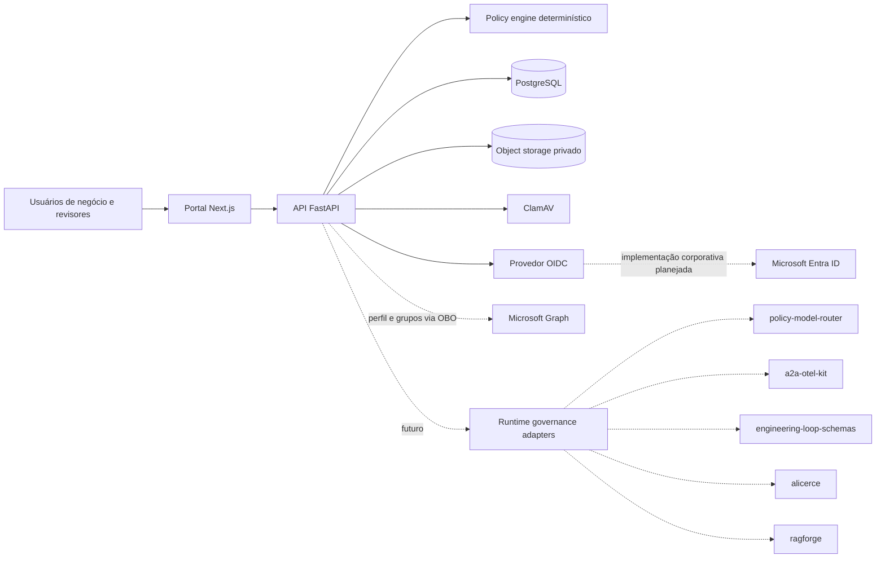
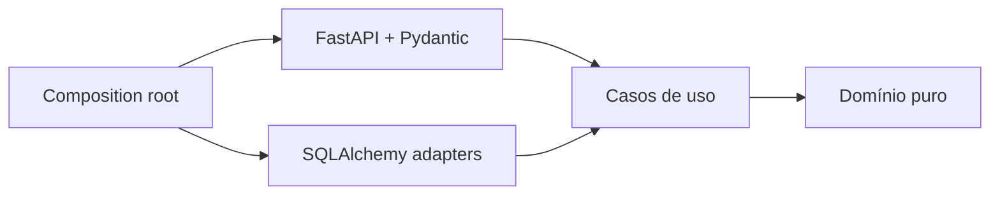
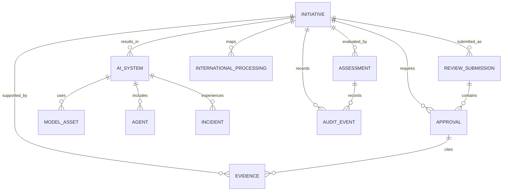

# Arquitetura

## Visão de contexto

## Componentes

### Portal

Next.js 16 com App Router. O navegador acessa a API diretamente no ambiente local. A
interface prioriza termos de negócio, apresenta risco, documentos e gates, e mantém os
detalhes técnicos sob demanda.

### API

FastAPI, SQLAlchemy assíncrono e Pydantic. A API é a autoridade sobre transições de
estado, segregação de funções, autorização, versionamento e auditoria. Regras críticas
não dependem de validações do frontend.

Os routers são adaptadores HTTP finos. Serviços de aplicação coordenam casos de uso,
transações e auditoria sem depender de exceções ou status do FastAPI. Dependências são
ligadas no composition root: em especial, a avaliação de política depende do contrato
`PolicyEvaluator`, permitindo substituir o motor determinístico por outra implementação
compatível sem alterar o caso de uso (Dependency Inversion).

Erros esperados usam categorias de aplicação estáveis e são traduzidos para HTTP apenas
na borda. Configuração de deploy é imutável, fornecida pelo ambiente e validada de forma
fail-closed antes de servir tráfego.

### Identidade e autenticação

O domínio contém apenas a identidade imutável e as regras de mapeamento de claims. O
caso de uso depende de uma porta `TokenVerifier`; o adapter PyJWT implementa validação
criptográfica por JWKS; FastAPI apenas converte bearer credentials e erros tipados para
HTTP. A busca síncrona e cacheada de chaves executa fora do event loop.

Issuer, audience, JWKS URL, algoritmos, claims, timeouts e limites vêm do ambiente. A
configuração aceita somente algoritmos assimétricos conhecidos, exige TLS fora de local
e teste e não deriva endpoints do provedor. Tokens precisam conter `exp`, `iat` e `sub`.
Somente o booleano JSON `true` concede administração; papéis desconhecidos não se
transformam em áreas de aprovação.

O compose OIDC opcional importa um realm Keycloak declarativo para validar emissão real,
audience, grupos e rejeição de credenciais ausentes ou adulteradas. Essa implementação
de teste não acopla o runtime ao Keycloak.

O portal já possui um adapter Microsoft Entra ID com MSAL Browser/React, Authorization
Code + PKCE, authority tenant-specific, cache em `sessionStorage` e access token
destinado à API. Em modo Entra, o client remove headers de identidade simulada e envia
somente bearer token; a API continua sendo a autoridade sobre autenticação e
autorização. O modo local permanece explicitamente separado.

No modo corporativo, o domínio exige `tid` e `oid` como UUIDs e produz a identidade
estável composta `(tenant_id, object_id)`. O tenant precisa estar na allowlist e
coincidir com o issuer Entra tenant-specific. O claim opcional `acct` classifica membro
ou guest; guest e classificação ausente/ambígua perdem áreas de aprovação e
administração por padrão.

Microsoft Graph via OBO implementa a porta `CorporateDirectoryPort` para obter perfil,
`department` e object IDs de grupos transitivos com coleta mínima. O adapter usa
endpoints fixos, timeouts, paginação validada e retry limitado para leituras
idempotentes. `Retry-After` é respeitado somente dentro do orçamento interativo; sem
esse header, o adapter usa backoff exponencial com jitter. A troca OBO não é repetida
automaticamente. O caso de uso vincula o resultado a `(tenant_id, object_id)`. O
endpoint expõe apenas o perfil; quantidade e lista de grupos permanecem internas.
Tokens Entra podem fornecer no máximo 200 object IDs no claim `groups`. O domínio
distingue claim ausente, completo e overage; `_claim_sources` nunca controla rede. Um
snapshot Graph confiável prevalece sobre o token, enquanto overage sem Graph nega
somente capacidades baseadas em grupo e registra a fonte minimizada na provenance.
Autorizações continuarão derivadas somente de App
Roles ou object IDs presentes no catálogo YAML tenant-specific, nunca de nomes ou de
`department`. A decisão retorna catálogo, versão, digest e mapping IDs; aprovações
persistem essa provenance na cadeia de auditoria. O padrão empacotado é vazio e alterações podem
ser fornecidas por configuração externa. O plano detalhado está em
`MICROSOFT_ENTRA_GRAPH_PLAN.md`; as decisões estão nos ADRs 0011 a 0016.

### Assessments estruturados

O módulo de assessments aplica Clean Architecture com dependências apontando para o
núcleo. Tipos imutáveis e regras de aplicabilidade vivem no domínio; casos de uso
definem as portas de persistência, auditoria e transação que consomem; adapters
SQLAlchemy implementam essas portas; Pydantic e FastAPI existem apenas na borda HTTP.

Cada definição tem contrato e versão explícitos. O banco garante apenas uma avaliação
corrente por tipo e iniciativa. Rascunhos pertencem ao owner (ou administrador), usam
versão esperada para mutações e, quando submetidos, tornam-se imutáveis até existir o
workflow explícito de revisão e ressubmissão. A auditoria registra tipo, versão, risco e
campos alterados, sem duplicar respostas potencialmente sensíveis.

### Rodadas de revisão

Transições críticas de revisão e segregação de funções vivem em um domínio puro,
independente de FastAPI, Pydantic e SQLAlchemy. Cada submissão materializa um snapshot
imutável da proposta e dos assessments e cria gates exclusivos daquela rodada. A
projeção `Initiative` aponta para a rodada corrente, enquanto o histórico permanece
consultável de forma minimizada por participantes autorizados.

Comandos de submissão, revisão, ressubmissão e decisão bloqueiam a iniciativa na
transação e validam versões esperadas. Uma solicitação de ajuste encerra a rodada,
substitui gates pendentes e reabre assessments. O owner salva os novos fatos primeiro;
a política recalcula documentos e gates para permitir criar assessments recém-exigidos.
A nova rodada só nasce depois que todos os assessments estruturados aplicáveis foram
enviados. Snapshots completos não são expostos pela API de histórico nem copiados para
auditoria.

O desenho também preserva propriedades dos Twelve-Factor Apps: configuração vem do
ambiente, processos de API permanecem stateless, PostgreSQL é um backing service
substituível por configuração, logs são eventos e dependências são declaradas e
reprodutíveis pelos lockfiles.

### Governance schemas

Pacote compartilhado que define enums, contexto de política, decisão, breakdown de
risco e requisitos de aprovação. É independente de FastAPI e da persistência.

### Policy engine

Função determinística e versionada. Recebe um contexto completo e retorna score, tier,
documentos, bloqueios e a situação de cada gate. Não faz I/O e pode ser testada ou
substituída por uma implementação compatível.

### Catálogo de controles

O catálogo baseline é um YAML versionado validado por contratos imutáveis do pacote
`governance-schemas`. O `policy-engine` carrega o recurso uma vez e avalia seletores
declarativos contra o mesmo contexto normalizado usado na classificação de risco. A
aplicação consome apenas a porta `ControlCatalogPort`; FastAPI e SQLAlchemy permanecem
nos adapters externos.

O relatório contém os 25 controles, resultado e razões para cada um, além da versão do
catálogo. Ele é derivado sob consulta, não persistido, evitando estado duplicado e
permitindo reavaliação determinística. Um caminho alternativo pode ser injetado por
`CONTROL_CATALOG_PATH`; falhas de leitura ou validação interrompem a inicialização.

### Persistência

PostgreSQL mantém o estado transacional. Entidades mutáveis possuem `version`; comandos
de decisão exigem `expected_version`. Eventos de auditoria são append-only e encadeados
por hash para tornar alterações posteriores detectáveis.

No Compose, um processo one-shot executa `alembic upgrade head` depois que PostgreSQL
fica saudável. A API depende da conclusão bem-sucedida desse processo e usa
`AUTO_CREATE_SCHEMA=false`; falha ou drift interrompem o startup em vez de permitir que
um modelo ORM mais novo consulte um schema persistente antigo. `create_all` permanece
apenas como conveniência local explicitamente opt-in, nunca como mecanismo de upgrade.

### Backup e restore assurance

O backup operacional também segue dependências apontando para dentro. Casos de uso
coordenam portas de archive, PostgreSQL e object storage; adapters usam filesystem,
ferramentas do container e S3; a CLI atua apenas como composition root. O pacote une
dump lógico e objetos por um manifesto versionado, privado e validado por SHA-256.

O inventário de objetos é comparado à quantidade de metadados confiáveis no banco,
detectando backups parciais. Como não existe transação distribuída entre PostgreSQL e
S3, a política exige quiesce de escritas. Restore só ocorre em destinos inexistentes e
o assurance restaura em banco/bucket aleatórios, compara revisão, tabelas, metadados e
conteúdo, e limpa os alvos isolados. Consulte o ADR 0010 e o runbook operacional.

### Evidências anexadas

Uploads passam por um pipeline fail-closed independente do transporte: leitura
limitada, validação de tipo e assinatura, SHA-256, scan ClamAV, storage S3 privado e
persistência transacional dos metadados e evento de auditoria. O nome original é apenas
metadado de exibição; a chave do objeto é gerada pela aplicação. Se a transação falhar,
o objeto é removido por compensação. A API não expõe coordenadas internas do storage.

Referências URI informadas durante uma decisão continuam separadas e não recebem o
status de artefato verificado. Configuração de tamanho, tipos, serviços, timeouts,
bucket e criptografia vem do ambiente; fora de local, criação automática de bucket é
recusada e criptografia server-side é obrigatória.

### Inventário operacional

Uma iniciativa em estado `approved` pode originar um ou mais sistemas. A criação é
restrita ao owner da iniciativa; mutações de sistema, modelo e agente são restritas ao
owner do sistema ou a um administrador. Todos os comandos mutáveis exigem a versão
esperada. Aposentadoria substitui exclusão física e fecha o agregado para novas
alterações, preservando os registros e eventos de auditoria.

## Modelo lógico inicial

## Limites de confiança

- o navegador não é confiável para autorização ou transição de estado;
- identidade local só existe quando `APP_ENV=local` e exige header explícito;
- fora de local, a configuração sem OIDC é recusada na inicialização;
- tokens OIDC são limitados, validados contra issuer/audience/assinatura e nunca logados;
- uma declaração de agente não equivale a evidência confiável;
- referências de evidência informadas por humanos começam como `trusted_source=false`;
- uploads só se tornam `trusted_source=true` depois de validação e scan limpo;
- conteúdo de prompts e documentos não deve entrar na trilha operacional por padrão.
- snapshots de revisão herdam retenção e proteção do banco e não são retornados no
  histórico resumido.

## Portas de integração futuras

| Integração | Entrada esperada | Evidência produzida |
|---|---|---|
| Microsoft Entra ID/Graph | token, perfil e object IDs delegados | identidade, área e provenance do mapeamento |
| `policy-model-router` | contexto de risco e classe de dado | decisão, policy digest e rejeições |
| `a2a-otel-kit` | spans/eventos sanitizados | correlação de modelos, agentes, A2A e MCP |
| `engineering-loop-schemas` | contrato, execução e veredito | evidência independente vinculada ao artefato |
| `alicerce` | pedido de execução controlada | limites, isolamento e resultado verificável |
| `ragforge` | dataset e estratégia versionados | métricas, regressões e provenance de fontes |

Adaptações devem depender de contratos internos, ser idempotentes e não alterar uma
decisão aprovada sem abrir change assessment.
