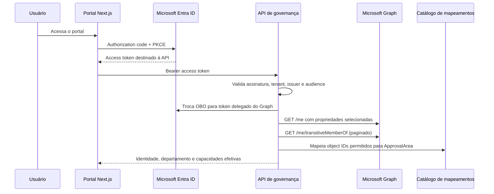

# Plano de integração — Microsoft Entra ID e Microsoft Graph

## Objetivo

Adicionar uma implementação corporativa de identidade sem tornar o núcleo dependente
da Microsoft. O portal deverá identificar automaticamente o usuário autenticado, obter
seu perfil organizacional e resolver as áreas de governança às quais ele pode responder.

O plano separa dois conceitos que não são equivalentes:

- **área organizacional:** atributo informativo, como `department`, obtido do diretório;
- **área de aprovação:** capacidade de autorização, derivada somente de App Roles ou de
  grupos Entra explicitamente mapeados para a taxonomia `ApprovalArea`.

O texto livre de `department`, cargo, e-mail ou nome do grupo nunca concederá permissão.

## Fluxo proposto



O portal usará OpenID Connect com authorization code e PKCE. A API continuará sendo o
resource server e validará access tokens destinados à própria audience. Para chamar o
Microsoft Graph com a identidade delegada, a API usará OAuth 2.0 On-Behalf-Of (OBO),
sem encaminhar ao Graph o token emitido para a API.

## Identificação automática

A identidade corporativa deverá usar a chave composta `(tenant_id, object_id)`,
derivada dos claims Entra `tid` e `oid`. `sub` continuará aceito no contrato OIDC geral,
mas não será usado como identificador corporativo entre aplicações Entra.

Após o primeiro acesso, a plataforma criará ou atualizará um snapshot JIT mínimo:

- tenant ID e object ID;
- nome de exibição;
- e-mail ou user principal name;
- `department`, empresa, cargo e localização somente quando necessários;
- tipo de usuário, incluindo guest quando disponível;
- origem, horário da sincronização e versão da política de mapeamento.

O Graph será consultado com `$select` explícito. Tokens, refresh tokens e respostas
completas do diretório não serão persistidos nem registrados em logs.

## Resolução da área do usuário

O catálogo de mapeamento terá registros versionados semelhantes a:

```yaml
tenant_id: 00000000-0000-0000-0000-000000000000
group_object_id: 11111111-1111-1111-1111-111111111111
approval_area: security
enabled: true
owner: identity-and-access-management
mapping_version: 1
```

Regras:

1. comparar somente tenant e object ID, nunca `displayName`;
2. aceitar apenas áreas presentes na enumeração corporativa;
3. suportar associação transitiva de grupos;
4. registrar versão do mapeamento e horário da resolução;
5. remover a capacidade quando o grupo deixar de estar mapeado ou a associação expirar;
6. aplicar segregação de funções mesmo que o diretório conceda a área;
7. tratar usuários guest por política explícita e, por padrão, sem poder de aprovação;
8. permitir App Roles como alternativa preferencial para autorizações estáveis do
   aplicativo, mantendo grupos para alinhamento com a estrutura corporativa.

O atributo `department` será exibido como a área organizacional do perfil e poderá
ajudar em filtros ou roteamento. Ele não substituirá o catálogo de autorização.

## Claims de grupos e overage

O acesso rápido poderá usar object IDs presentes no claim `groups`, desde que o token
esteja validado, o tenant esteja autorizado e não exista indicação de overage. Quando
o Entra omitir grupos por excesso de associações, a API consultará o Microsoft Graph.

A aplicação não seguirá URLs fornecidas por `_claim_sources`. Ela construirá chamadas
somente para o endpoint Microsoft Graph configurado, evitando que um claim controle o
destino de rede. Paginação também aceitará `@odata.nextLink` apenas no host Graph
permitido.

## Permissões mínimas

Baseline proposto:

- portal: `openid`, `profile`, `email` e o scope delegado da API;
- API: scope delegado próprio e credencial de confidential client protegida;
- Graph via OBO: iniciar com `User.Read`, suficiente para perfil e associações
  transitivas do próprio usuário segundo a documentação atual;
- não solicitar `Directory.Read.All` no MVP;
- qualquer permissão adicional exige threat model, justificativa, consentimento e
  aprovação de IAM, Segurança e Privacidade.

A credencial da API deverá vir de secret manager; certificado é preferível a segredo
estático. Nenhuma credencial Entra será armazenada no repositório.

## Disponibilidade e comportamento fail-closed

- autenticação e validação do token não dependem de uma chamada ao Graph por request;
- perfil e associações usam cache com TTL curto e invalidação auditável;
- throttling respeita `Retry-After`, com retry limitado e jitter;
- aprovação de gate falha de forma fechada quando a capacidade não puder ser resolvida
  com dados suficientemente recentes;
- acesso não privilegiado pode usar snapshot ainda válido conforme política;
- mudança de tenant, issuer, consentimento ou mapeamento exige configuração versionada;
- remoção urgente de acesso deve invalidar cache e sessão da plataforma.

## Dados, privacidade e auditoria

O Graph adiciona um novo tratamento de dados pessoais e deve entrar no inventário,
RIPD quando aplicável e análise de processamento internacional. A coleta deve respeitar
necessidade, minimização, retenção e finalidade.

Evidências auditáveis mínimas:

- tenant e object ID que originaram a identidade;
- fonte usada: token, App Role, Graph ou cache válido;
- IDs dos mapeamentos aplicados, não a listagem completa de grupos;
- versão do catálogo, horário e decisão de autorização;
- falha, stale data ou overage sem registrar bearer tokens.

## Entregas planejadas

Status em 2026-08-01: o adapter MSAL do portal, PKCE, `sessionStorage`, login/logout,
token silencioso da API, identidade `(tid, oid)`, tenant allowlist, política fail-closed
para guest/conta sem `acct` confiável e enriquecimento Graph via OBO estão
implementados. O adapter Graph possui `$select` mínimo, grupos transitivos, paginação
com destino validado, timeout, retry limitado para leituras idempotentes, jitter e
eventos operacionais sem conteúdo. O catálogo versionado App Role/object ID também está
implementado com provenance auditável. Claims completos de grupos e os indicadores de
group overage são tratados sem seguir `_claim_sources`. Validação contra tenant real,
cache, revogação e assurance permanecem pendentes.

### Fase 1 — Fundação Entra

- app registrations separadas para portal e API;
- tenant allowlist e issuer tenant-specific;
- scopes, App Roles, redirect URIs e consentimentos documentados;
- configuração por ambiente e runbook de rotação de credencial.

### Fase 2 — Login do portal

- MSAL com authorization code e PKCE;
- identidade automática sem headers de desenvolvimento;
- logout, expiração, reautenticação e tratamento de Conditional Access;
- testes de token para tenant, issuer, audience e usuário guest.

### Fase 3 — Enriquecimento Graph

- [x] porta de aplicação `CorporateDirectoryPort`;
- [x] adapter Microsoft Graph com OBO, timeout e paginação validada;
- [x] perfil `/me` com `$select` mínimo;
- [x] associações transitivas de grupos;
- [x] retry limitado com jitter e monitoramento básico de throttling;
- [ ] cache curto com freshness explícita e invalidação distribuída.

### Fase 4 — Mapeamento governado

- [x] catálogo versionado grupo/App Role → `ApprovalArea`;
- [x] workflow de alteração como código com IAM, Segurança e Governança de IA;
- [x] endpoint de identidade com área organizacional, capacidades e provenance;
- [x] provenance do catálogo no evento auditável de decisão;
- [ ] auditoria de sincronização, cache e revogação.

### Fase 5 — Assurance

- [x] testes de group overage e grupos aninhados;
- [ ] testes de guest e usuário desabilitado contra tenant real;
- [x] testes determinísticos de Graph `429/5xx` e esgotamento do retry;
- [ ] testes de remoção de grupo, cache expirado e rotação de chave;
- revisão de consentimentos e least privilege;
- monitoramento de falhas, latência, stale identity e mappings sem owner.

## Critérios de aceite

- login identifica o usuário sem entrada manual de ID, e-mail ou área;
- API rejeita token de outro tenant ou audience;
- `department` é exibido, mas nunca concede aprovação;
- somente object IDs/App Roles mapeados geram `ApprovalArea`;
- grupos transitivos e overage são tratados;
- guest não aprova sem política explícita;
- remoção de associação revoga a capacidade dentro do SLA definido;
- indisponibilidade do Graph não promove usuário nem reutiliza snapshot expirado;
- decisões registram provenance sem tokens ou inventário integral de grupos;
- testes e runbooks demonstram consentimento mínimo, rotação e revogação.

## Referências oficiais

- [Authorization code com PKCE](https://learn.microsoft.com/en-us/entra/identity-platform/v2-oauth2-auth-code-flow)
- [Fluxo On-Behalf-Of](https://learn.microsoft.com/en-us/entra/msal/msal-authentication-flows#on-behalf-of-obo)
- [Obter o usuário autenticado no Graph](https://learn.microsoft.com/en-us/graph/api/user-get?view=graph-rest-1.0)
- [Associações transitivas do usuário](https://learn.microsoft.com/en-us/graph/api/user-list-transitivememberof?view=graph-rest-1.0)
- [Claims e group overage](https://learn.microsoft.com/en-us/entra/identity-platform/access-token-claims-reference#groups-overage-claim)
