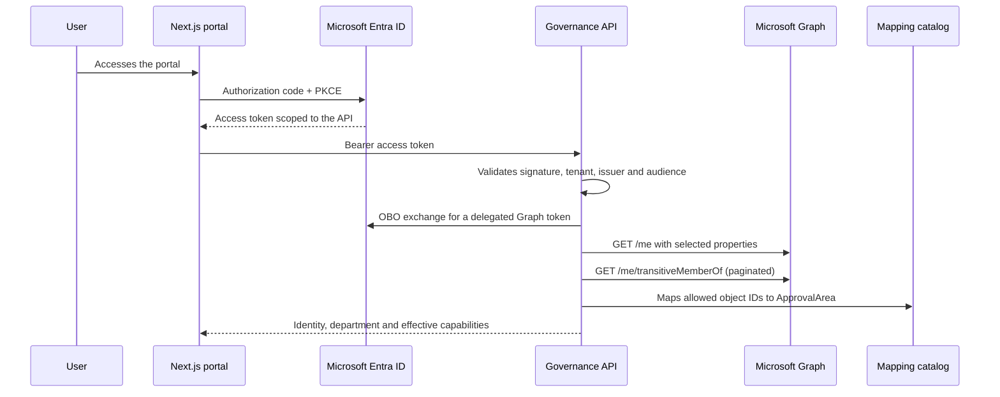

# Integration plan - Microsoft Entra ID and Microsoft Graph

## Objective

Add a corporate identity implementation without making the core dependent on
Microsoft. The portal should automatically identify the authenticated user, obtain
their organizational profile, and resolve the governance areas they can act on.

The plan separates two concepts that are not equivalent:

- **organizational area:** an informative attribute, such as `department`, obtained
  from the directory;
- **approval area:** an authorization capability, derived only from App Roles or
  from Entra groups explicitly mapped to the `ApprovalArea` taxonomy.

Free text from `department`, job title, email or group name will never grant
permission.

## Proposed flow



The portal will use OpenID Connect with authorization code and PKCE. The API will
remain the resource server and will validate access tokens scoped to its own
audience. To call Microsoft Graph with the delegated identity, the API will use
OAuth 2.0 On-Behalf-Of (OBO), without ever forwarding the token issued to the API
to the Graph.

## Automatic identification

Corporate identity should use the composite key `(tenant_id, object_id)`, derived
from the Entra claims `tid` and `oid`. `sub` will remain accepted in the general
OIDC contract but will not be used as the cross-application corporate identifier
within Entra.

After the first access, the platform will create or update a minimal JIT snapshot:

- tenant ID and object ID;
- display name;
- email or user principal name;
- `department`, company, job title and location only when needed;
- user type, including guest when available;
- source, sync timestamp and mapping policy version.

Graph will be queried with an explicit `$select`. Tokens, refresh tokens and full
directory responses will not be persisted or logged.

## Resolving the user's area

The mapping catalog will hold versioned records similar to:

```yaml
tenant_id: 00000000-0000-0000-0000-000000000000
group_object_id: 11111111-1111-1111-1111-111111111111
approval_area: security
enabled: true
owner: identity-and-access-management
mapping_version: 1
```

Rules:

1. compare only tenant and object ID, never `displayName`;
2. accept only areas present in the corporate enumeration;
3. support transitive group membership;
4. record mapping version and resolution timestamp;
5. remove the capability once the group is no longer mapped or membership expires;
6. enforce separation of duties even when the directory grants the area;
7. handle guest users via explicit policy and, by default, without approval power;
8. allow App Roles as the preferred alternative for stable application
   authorizations, keeping groups for alignment with the corporate structure.

The `department` attribute will be displayed as the profile's organizational area
and may help with filtering or routing. It will not replace the authorization
catalog.

## Group claims and overage

Quick access can use object IDs present in the `groups` claim, provided the token
is validated, the tenant is authorized and there is no overage indication. When
Entra omits groups due to excess memberships, the API will query Microsoft Graph.

The application will not follow URLs supplied by `_claim_sources`. It will build
calls only to the configured Microsoft Graph endpoint, preventing a claim from
controlling the network destination. Pagination will also accept
`@odata.nextLink` only on the allowed Graph host.

## Minimal permissions

Proposed baseline:

- portal: `openid`, `profile`, `email` and the API's delegated scope;
- API: its own delegated scope and a protected confidential-client credential;
- Graph via OBO: start with `User.Read`, sufficient for the user's own profile and
  transitive memberships per current documentation;
- do not request `Directory.Read.All` in the MVP;
- any additional permission requires a threat model, justification, consent and
  approval from IAM, Security and Privacy.

The API credential should come from a secret manager; a certificate is preferred
over a static secret. No Entra credential will be stored in the repository.

## Availability and fail-closed behavior

- authentication and token validation do not depend on a Graph call per request;
- capabilities derived from profile and memberships use a shared cache with a short
  TTL and auditable invalidation;
- throttling honors `Retry-After`, with bounded retry and jitter;
- gate approval fails closed when the capability cannot be resolved with
  sufficiently fresh data;
- non-privileged access may use a still-valid snapshot per policy;
- changing tenant, issuer, consent or mapping requires versioned configuration;
- urgent access removal must trigger the platform's persistent restriction,
  invalidate the cache and coordinate account/session revocation in Entra.

## Data, privacy and auditing

Graph adds a new personal-data processing activity and must enter the inventory,
the RIPD where applicable, and the international processing analysis. Collection
must respect necessity, minimization, retention and purpose.

Minimal auditable evidence:

- tenant and object ID that originated the identity;
- source used: token, App Role, Graph or valid cache;
- IDs of the mappings applied, not the full group listing;
- catalog version, timestamp and authorization decision;
- failure, stale data or overage without recording bearer tokens.

## Planned deliverables

Status as of 2026-08-01: the portal's MSAL adapter, PKCE, `sessionStorage`,
login/logout, silent API token acquisition, `(tid, oid)` identity, tenant
allowlist, fail-closed policy for guest/no-trusted-`acct` accounts and Graph
enrichment via OBO are implemented. The Graph adapter has a minimal `$select`,
transitive groups, pagination with a validated destination, timeout, bounded retry
for idempotent reads, jitter and content-free operational events. The versioned
App Role/object ID catalog is also implemented with auditable provenance. Full
group claims and group-overage indicators are handled without following
`_claim_sources`. The PostgreSQL cache of derived capabilities has an explicit
TTL, binding to the catalog digest and distributed administrative invalidation.
The platform's emergency block/restore is also persistent, audited, fail-closed
and applied before every protected route. Validation against a real tenant,
provider-side session revocation and assurance remain pending.

### Phase 1 - Entra foundation

- separate app registrations for portal and API;
- tenant allowlist and tenant-specific issuer;
- documented scopes, App Roles, redirect URIs and consents;
- per-environment configuration and a credential-rotation runbook.

### Phase 2 - Portal login

- MSAL with authorization code and PKCE;
- automatic identity with no development headers;
- logout, expiry, re-authentication and Conditional Access handling;
- token tests for tenant, issuer, audience and guest users.

### Phase 3 - Graph enrichment

- [x] `CorporateDirectoryPort` application port;
- [x] Microsoft Graph adapter with OBO, timeout and validated pagination;
- [x] `/me` profile with minimal `$select`;
- [x] transitive group memberships;
- [x] bounded retry with jitter and basic throttling monitoring;
- [x] short cache with explicit freshness and distributed invalidation.

### Phase 4 - Governed mapping

- [x] versioned group/App Role → `ApprovalArea` catalog;
- [x] change-as-code workflow with IAM, Security and AI Governance;
- [x] identity endpoint with organizational area, capabilities and provenance;
- [x] catalog provenance in the auditable decision event;
- [x] minimized cache-invalidation auditing.
- [x] local emergency restriction with auditing and atomic cache invalidation;
- [ ] provider-side sync and revocation auditing.

### Phase 5 - Assurance

- [x] tests for group overage and nested groups;
- [ ] guest and disabled-user tests against a real tenant;
- [x] deterministic tests for Graph `429/5xx` and retry exhaustion;
- [x] deterministic tests for expired cache and concurrent invalidation;
- [x] deterministic tests for block/restore across every protected route;
- [ ] group-removal and key-rotation tests against a real tenant;
- consent and least-privilege review;
- monitoring of failures, latency, stale identity and unowned mappings.

## Acceptance criteria

- login identifies the user without manual entry of ID, email or area;
- the API rejects tokens from another tenant or audience;
- `department` is displayed but never grants approval;
- only mapped object IDs/App Roles produce an `ApprovalArea`;
- transitive groups and overage are handled;
- guests do not approve without explicit policy;
- membership removal revokes the capability within the defined SLA;
- an emergency block stops the next protected request across all replicas;
- Graph unavailability never promotes a user nor reuses an expired snapshot;
- decisions record provenance without tokens or a full group inventory;
- tests and runbooks demonstrate minimal consent, rotation and revocation.

## Official references

- [Authorization code with PKCE](https://learn.microsoft.com/en-us/entra/identity-platform/v2-oauth2-auth-code-flow)
- [On-Behalf-Of flow](https://learn.microsoft.com/en-us/entra/msal/msal-authentication-flows#on-behalf-of-obo)
- [Get the authenticated user in Graph](https://learn.microsoft.com/en-us/graph/api/user-get?view=graph-rest-1.0)
- [User transitive memberships](https://learn.microsoft.com/en-us/graph/api/user-list-transitivememberof?view=graph-rest-1.0)
- [Claims and group overage](https://learn.microsoft.com/en-us/entra/identity-platform/access-token-claims-reference#groups-overage-claim)
- [Revoke user access in an emergency](https://learn.microsoft.com/pt-br/entra/identity/users/users-revoke-access)
- [`revokeSignInSessions` in Microsoft Graph](https://learn.microsoft.com/en-us/graph/api/user-revokesigninsessions?view=graph-rest-1.0)
