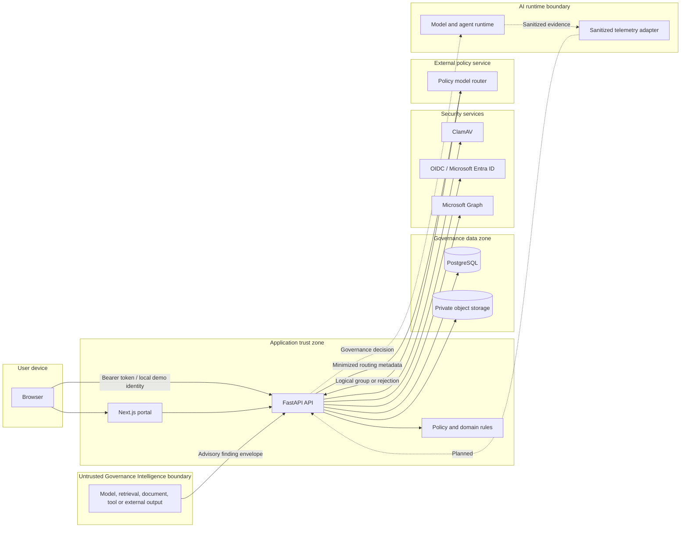
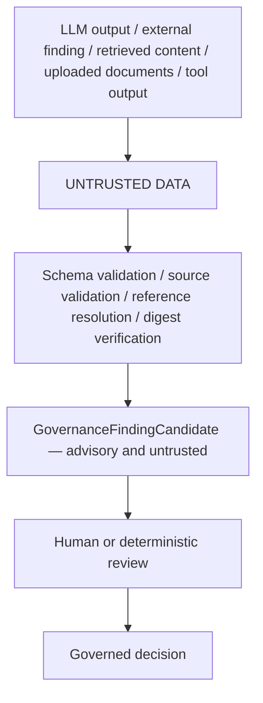

# Trust boundaries

- **Status:** Current
- **Owner:** Architecture and security
- **Last reviewed:** 2026-08-16
- **Review trigger:** Network, identity, storage, runtime or deployment topology change

## Context diagram

## Boundary assumptions

### User device

The browser and local device are untrusted. Client-side hiding, validation or route
protection is a usability feature, not authorization.

### Application trust zone

The API process is trusted to execute reviewed code and configuration. The portal is not
trusted with governance authority. Domain and application rules remain authoritative.

### Governance data zone

PostgreSQL and object storage contain sensitive governance information. Network access,
credentials, encryption, retention and backup handling must be controlled independently
from application authorization.

### Identity and directory services

Identity providers attest authentication. They do not directly decide governance-area
semantics. The application maps trusted claims and directory object IDs through an
explicit, versioned catalog.

### Malware scanner

ClamAV is trusted to provide a scan result but is not treated as infallible. Scanner
unavailability blocks the upload. Allowed files can still require safe viewers and
content-disarm policies in stricter environments.

### External model router

The router is not trusted to approve governance scope. It may choose only among logical
groups that the application has already determined to be eligible. Its response is
validated before acceptance.

### AI runtime

A future or external runtime must enforce or consume governance decisions correctly. A
runtime that bypasses the governance API remains outside the assurance boundary.

### Governance Intelligence

Model output, external findings, retrieved content, uploaded documents and tool output are
untrusted data. A structurally valid finding remains advisory and cannot approve a system or
control, declare compliance, authorize or release runtime scope, sign an authorization, operate
the kill switch, restore runtime or mutate a governed decision.

The application-owned `GovernanceIntelligencePort` exposes analysis and recommendation operations
only. Future provider, agent and retrieval implementations remain adapters outside the
deterministic core.

Schema validation establishes shape, not truth or authority. Source validation and digest
verification bind a candidate to resolved bytes but do not prove that its interpretation is
correct. An external finding is not an approved governance decision. An AI-generated
interpretation is not evidence; the original artifact is the potential evidence.

## Authority model

| Layer | Authority |
|---|---|
| Governance Intelligence | Advisory, untrusted and non-authoritative |
| Deterministic governance core | Authoritative for governed state transitions and decisions |
| Runtime enforcement | Authoritative within the scope and lifetime of a verified signed authorization |
| Evidence | Verifiable source artifact or proof; does not decide by itself |
| Runtime evidence | Proof of observed behavior or execution; interpreted through governed assurance rules |

## Data-flow rules

| Flow | Allowed data | Prohibited by default |
|---|---|---|
| Browser → API | Form fields, identifiers, expected versions, authorized files | Service credentials |
| API → Identity provider | Token verification/JWKS requests | Governance evidence content |
| API → Microsoft Graph | OBO token exchange and minimal profile/group queries | Assessment and evidence data |
| API → Model router | Workload, risk, data class, approved group constraints, cost/latency metadata | Prompts, documents, credentials, model responses |
| API → Logs | IDs, digests, categories, status, timing | Tokens, full assessment answers, evidence bodies, prompts and secrets |
| Runtime → Governance | Sanitized identifiers, metrics, decisions and evidence references | Raw content unless separately approved |
| Governance Intelligence → Governance | Versioned advisory finding, source references, bounded provenance and correlation IDs | Approval/compliance/authorization state, full prompts, chain-of-thought, document bodies, credentials and raw model responses |

## Deployment implications

- terminate TLS at a controlled boundary and preserve authenticated identity to the API;
- place PostgreSQL and object storage on private networks;
- restrict ClamAV and router egress/ingress to required paths;
- use workload identity or secret management for service credentials;
- apply edge rate limiting and request-size limits;
- export security events to an independently controlled monitoring destination;
- separate local demonstration configuration from shared environments.
