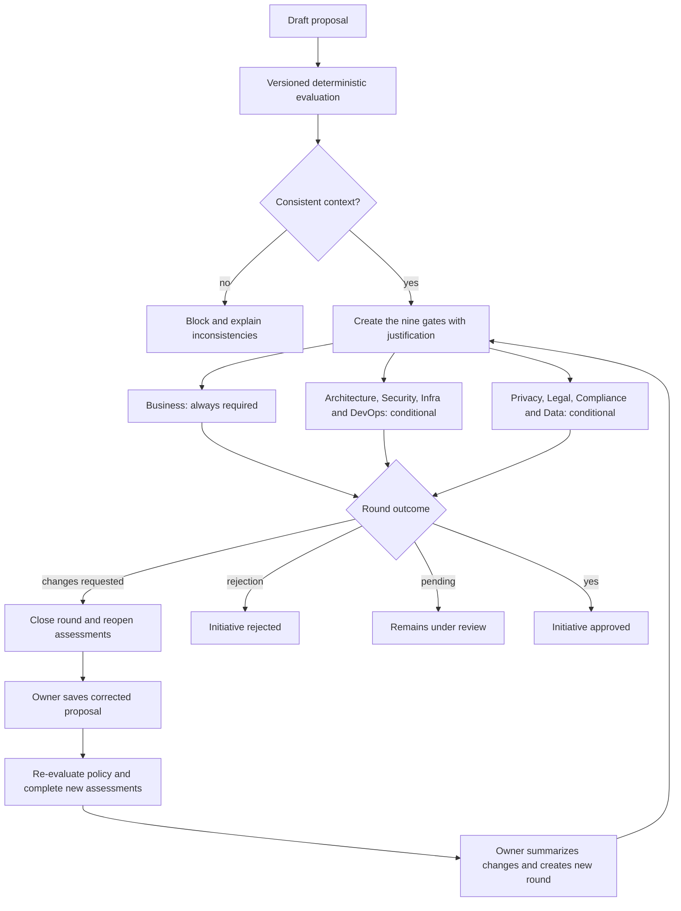

# Approval flow

## Initial triggers

- **Business:** always, confirming value, purpose and accountability.
- **Architecture:** advanced components or risk above low.
- **Security:** confidential/restricted data, agents, MCP, actions or elevated risk.
- **Infrastructure:** self-hosted/hybrid, in-house model or elevated risk.
- **DevOps:** actions, agents, MCP or a model operated by the organization.
- **Privacy:** any personal, sensitive, or children's/adolescents' data.
- **Legal:** international processing, impact on rights or external exposure.
- **Compliance:** regulated context or high/critical risk.
- **Data:** RAG, in-house model, personal data or non-public classification.

## Decision rules

1. The backend re-evaluates roles and state; the frontend does not authorize.
2. A decision requires justification, evidence reference and expected version.
3. `changes_requested` closes the round, replaces pending gates and reopens submitted
   assessments; it is not equivalent to a definitive rejection.
4. Only the owner can save the revision or resubmit. Saving the revision recalculates
   the requirements, and all required assessments must be submitted before the new
   round.
5. Each resubmission re-evaluates the policy and creates new gates; prior decisions
   remain bound to the original snapshot and round.
6. Rejection immediately moves the initiative to `rejected`.
7. Final approval only occurs when all mandatory gates of the current round are
   `approved`.
8. `not_required` gates remain visible to explain the policy decision.
9. At high or critical risk, one person cannot decide on behalf of distinct areas in
   the same round.
