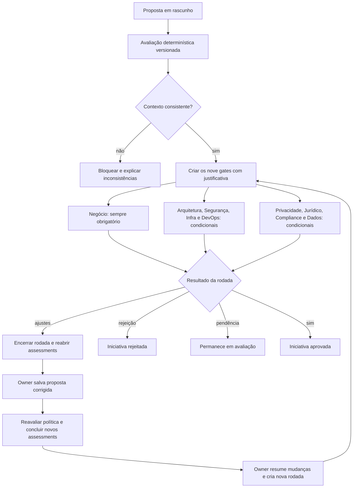

# Fluxo de aprovações

## Gatilhos iniciais

- **Negócio:** sempre, confirmando valor, finalidade e accountability.
- **Arquitetura:** componentes avançados ou risco acima de baixo.
- **Segurança:** dados confidenciais/restritos, agentes, MCP, ações ou risco elevado.
- **Infraestrutura:** self-hosted/híbrido, modelo próprio ou risco elevado.
- **DevOps:** ações, agentes, MCP ou modelo operado pela organização.
- **Privacidade:** qualquer dado pessoal, sensível ou de crianças/adolescentes.
- **Jurídico:** processamento internacional, impacto em direitos ou exposição externa.
- **Compliance:** contexto regulado ou risco alto/crítico.
- **Dados:** RAG, modelo próprio, dado pessoal ou classificação não pública.

## Regras da decisão

1. O backend reavalia papéis e estado; o frontend não autoriza.
2. Decisão exige justificativa, referência de evidência e versão esperada.
3. `changes_requested` encerra a rodada, substitui gates pendentes e reabre assessments
   submetidos; não equivale a rejeição definitiva.
4. Somente o owner pode salvar a revisão ou ressubmeter. A revisão salva recalcula os
   requisitos, e todos os assessments exigidos devem ser enviados antes da nova rodada.
5. Cada ressubmissão reavalia a política e cria gates novos; decisões anteriores ficam
   vinculadas ao snapshot e à rodada originais.
6. Rejeição muda imediatamente a iniciativa para `rejected`.
7. Aprovação final só ocorre quando todos os gates obrigatórios da rodada atual estão
   `approved`.
8. Gates `not_required` permanecem visíveis para explicar a decisão da política.
9. Em risco alto ou crítico, uma pessoa não pode decidir por áreas distintas na mesma
   rodada.
