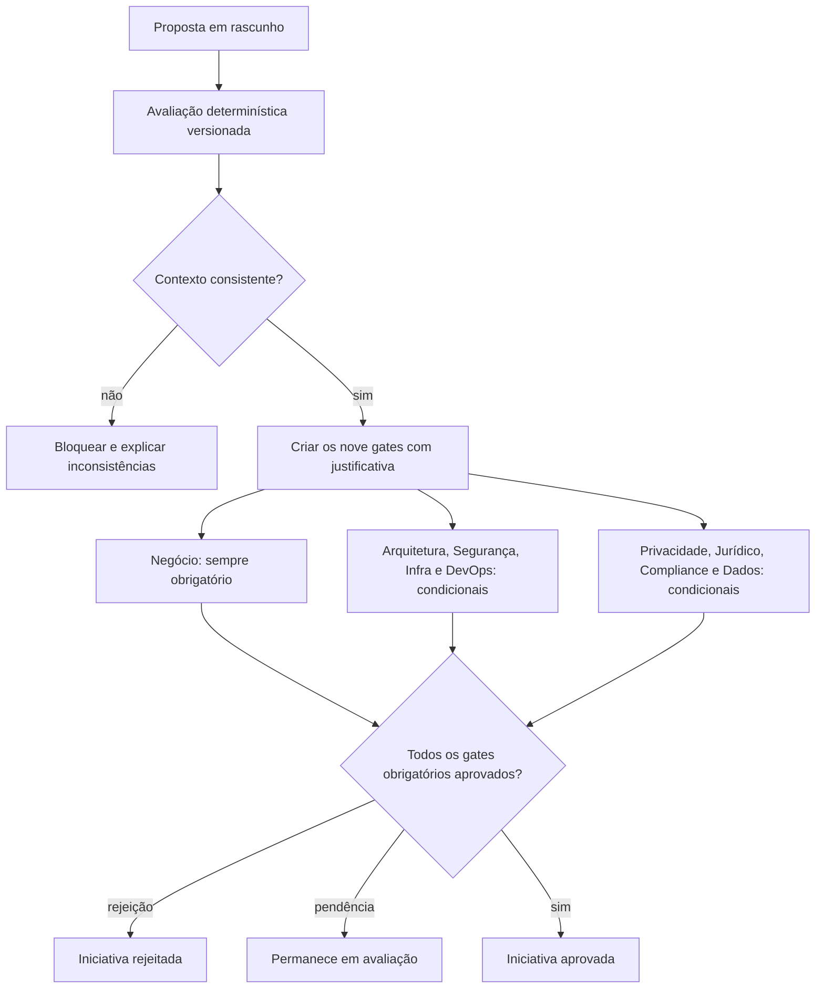

# Fluxo de aprovações

## Gatilhos iniciais

- **Negócio:** sempre, confirmando valor, finalidade e accountability.
- **Arquitetura:** componentes avançados ou risco acima de baixo.
- **Segurança:** dados confidenciais/restritos, agentes, MCP, ações ou risco elevado.
- **Infraestrutura:** self-hosted/híbrido, modelo próprio ou risco elevado.
- **DevOps:** ações, agentes, MCP ou modelo operado pela organização.
- **Privacidade:** qualquer dado pessoal, sensível ou de crianças/adolescentes.
- **Jurídico:** processamento internacional, impacto em direitos ou exposição externa.
- **Compliance:** contexto regulado ou risco alto/crítico.
- **Dados:** RAG, modelo próprio, dado pessoal ou classificação não pública.

## Regras da decisão

1. O backend reavalia papéis e estado; o frontend não autoriza.
2. Decisão exige justificativa, referência de evidência e versão esperada.
3. Rejeição muda imediatamente a iniciativa para `rejected`.
4. Aprovação final só ocorre quando todos os gates obrigatórios estão `approved`.
5. Gates `not_required` permanecem visíveis para explicar a decisão da política.
