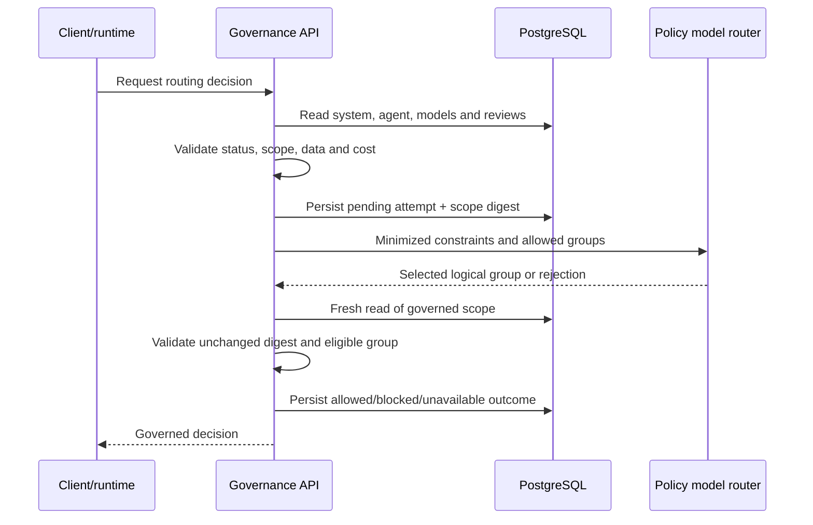

# Policy model router integration

- **Status:** Current design
- **Owner:** AI platform architecture
- **Last reviewed:** 2026-08-03
- **Review trigger:** Router contract, scope rule or runtime-enforcement change

## Purpose

The external policy model router selects a logical model group according to operational
constraints. It does not approve models, agents or data use.

The governance platform remains authoritative for the set of groups that may be used.

## Responsibility split

| Governance platform | External router |
|---|---|
| Validates system and asset state | Evaluates routing policy among supplied constraints |
| Validates current model and agent reviews | Returns a logical group or explicit rejection |
| Calculates eligible approved groups | Applies cost, latency or provider policy as configured |
| Enforces data-class and cost limits | Does not receive prompt or document content |
| Persists attempt and outcome | Does not mutate governance inventory |
| Rejects unauthorized router output | Cannot expand approved authority |

## Request minimization

Router requests should contain only operational metadata required for the decision, such
as:

- workload or use-case identifier;
- risk tier;
- data classification;
- allowed logical routing groups;
- cost and latency limits;
- required region or provider constraints when represented;
- correlation identifier.

Do not send:

- prompts;
- retrieved documents;
- model responses;
- assessment content;
- credentials;
- unnecessary personal data.

## Decision sequence

## Scope-change protection

A canonical digest is calculated before the external call and persisted with the pending
attempt. After the router returns, the application reads current state again and
recalculates the relevant scope.

If the digest changed, the outcome is blocked as a registry-scope change even when the
router's selected group would otherwise be valid.

This protects against approval or inventory changes during the network call.

## Failure behavior

| Condition | Expected result |
|---|---|
| No current approved agent | Blocked |
| No eligible approved model | Blocked |
| Data class outside approved scope | Blocked |
| Cost exceeds approved limit | Blocked |
| Router unavailable or timeout | Dependency unavailable; fail closed |
| Invalid or oversized response | Dependency unavailable; fail closed |
| Router returns a group not in eligible set | Blocked |
| Governed scope changes during call | Blocked |

The router call is not retried automatically when its operation cannot be proven
idempotent.

## Evidence

Persist at minimum:

- routing-attempt ID;
- governed system, agent and relevant model identifiers;
- pre-call scope digest;
- minimized request categories;
- router outcome and logical group;
- final governance result;
- blocked reason;
- timing and dependency status;
- correlation ID;
- policy/router contract version where available.

Do not persist prompt or document content as routing evidence.

## Integration tests

Required scenarios:

1. allowed group maps to an eligible approved model;
2. unapproved returned group is rejected;
3. no current agent review;
4. model review expired;
5. incompatible data class;
6. cost limit exceeded;
7. router timeout;
8. malformed response;
9. scope changes during call;
10. pending attempt remains visible if the process fails before finalization.

## Runtime contract

The downstream runtime must use the governed decision or an approved decision token and
must not independently substitute another model group. If runtime enforcement is not
integrated, this platform can record a decision but cannot guarantee that the execution
honored it.
